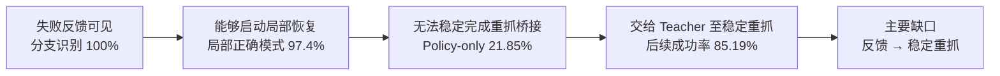
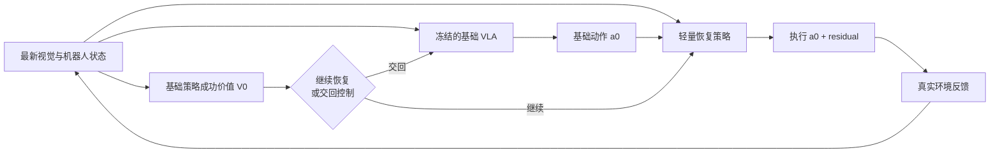
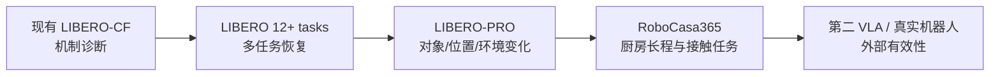
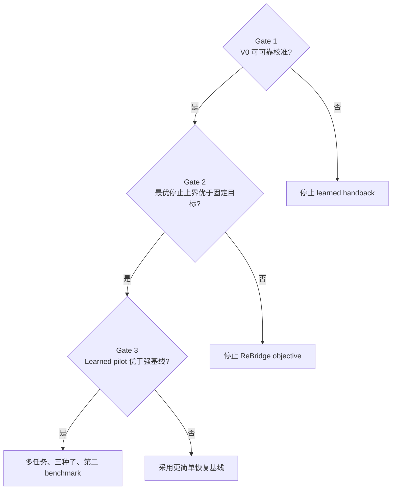

# ReBridge-VLA 研究构想简报

**题目：面向 VLA 失败恢复的策略相对恢复桥**  
**研究方向：机器人学习 / 视觉-语言-动作模型 / 强化学习**  
**阶段：研究构想与必要性验证，尚未形成方法结论**

## 一、研究问题

现有 VLA 在正常轨迹上具备较强任务能力，但在抓取滑落、接触偏差等失败发生后，往往无法稳定
恢复。已有方法主要关注失败检测、即时动作修正或完整任务再学习，较少显式研究：

> **恢复策略应纠正到何种状态，以及何时应将控制权交回基础 VLA？**

本研究拟学习一段与基础策略能力相匹配的闭环“恢复桥”，将失败状态引导至基础 VLA 能够可靠
完成后续任务的状态区域，同时尽量减少对正常能力的干扰。

### 前期证据



| 已验证现象 | 结果 | 含义 |
| --- | ---: | --- |
| 高频重规划 | `K=1` 仍未解决恢复 | 不是单纯执行 horizon 问题 |
| 短时纠正 | 3 或 12 个 teacher actions 无改善 | 局部修正不足以跨越恢复区间 |
| 离线恢复 SFT | clean/policy-state 两种训练均有负作用 | 完整 VLA 更新引入分布漂移和能力干扰 |
| 连续 continuation Oracle | slip success 提升 15.4 个百分点 | 闭环逐步纠正存在可利用上界 |

## 二、核心构想

设冻结基础 VLA 为 `pi_0`，定义：

```text
V_0(h) = 从当前观测历史 h 交回 pi_0 后的完整任务成功概率
```

恢复策略在每个时刻比较两种选择：

```text
立即交回基础 VLA：V_0(h)
继续执行恢复动作：E[U(h') - 动作成本 - 时间成本 - 失败风险]
```

对应的最优停止目标为：

```text
U*(h) = max { V_0(h),  max_delta E[U*(h') - c(delta, h)] }
```

### 方法框架



**设计原则**：

- 基础 Pi0.5 保持冻结，仅训练轻量 residual recovery policy；
- 恢复策略在自身产生的闭环状态上训练；
- 恢复终点由基础策略的后续成功能力决定，而非固定动作数或固定语义阶段；
- 使用保守置信下界控制 handback，降低过早交回风险；
- 固定动作执行频率，不引入动态 horizon、world model 或额外 VLM。

## 三、与现有工作的区别

| 研究路线 | 主要解决的问题 | 与本研究的差异 |
| --- | --- | --- |
| [A2C2](https://arxiv.org/abs/2509.23224) / [REMAC](https://arxiv.org/abs/2601.20130) | 根据最新观测修正过时动作块 | 偏重即时修正，不显式建模长恢复段的交回条件 |
| [RaC](https://arxiv.org/abs/2509.07953) / [VLA-OPD](https://arxiv.org/abs/2603.26666) | 在策略自身状态上提供纠正监督 | 依赖人工或 teacher，通常更新原策略 |
| [FLARE](https://openaccess.thecvf.com/content/CVPR2026/html/Zhao_FLARE_A_Failure-Aware_Framework_for_Autonomous_Correction_and_Recovery_in_CVPR_2026_paper.html) / [FailSafe](https://arxiv.org/abs/2510.01642) | 构造失败与恢复数据 | 重点是数据生成，而非策略相对 handback |
| [ReCoVLA](https://arxiv.org/abs/2606.09630) | 以 failure stage reward 训练 residual policy | 恢复目标由外部语义阶段定义 |
| [DICE-RL](https://arxiv.org/abs/2603.10263) | 用 residual RL 提升完整任务能力 | 直接优化完整任务，不单独学习恢复桥 |
| **ReBridge-VLA** | **到达基础策略可可靠接管的状态** | **以基础策略 continuation value 作为停止收益** |

拟验证的贡献不是 residual RL 或 option 本身，而是：

> **将冻结 VLA 的后续任务能力用于定义恢复目标和控制权交回，从而学习最小必要恢复桥。**

## 四、研究假设

1. **可估计性**：仅使用部署可用的视觉与短历史，可以可靠估计基础策略的接管成功概率。
2. **有效性**：策略相对恢复桥能够提高失败恢复率，并优于固定阶段和 full-task residual。
3. **能力保持**：冻结基础 VLA 可使正常任务成功率退化不超过 5 个百分点。
4. **泛化性**：主要收益能够在多个任务、两个 benchmark 和第二 VLA backbone 上复现。

## 五、实验设计

### Benchmark 规划



| 层级 | 数据与任务 | 论证目的 |
| --- | --- | --- |
| 机制实验 | 现有 128 组 LIBERO attached/slip 数据 | 验证 `V_0` 可估计性与目标上界 |
| 核心实验 1 | LIBERO Spatial/Object/Goal/Long，至少 12 个任务 | 多任务恢复与正常能力保持 |
| 鲁棒性实验 | LIBERO-PRO 的对象、位置和环境变化 | 检查是否依赖固定场景 |
| 核心实验 2 | RoboCasa365 原子及复合厨房任务 | 验证长程、关节物体和跨场景恢复 |
| 扩展实验 | 第二 VLA backbone；条件允许时真实机器人 | 检查方法是否依赖 Pi0.5 或仿真 |

失败类型包括抓取滑落、搬运掉落、目标位移、门/抽屉回弹及执行延迟。干预由真实物理事件触发，
每个失败 episode 均与同初始状态的 clean episode 配对。

### 主要对照

- 冻结基础 VLA，`K=1/2/3`；
- recovery SFT 与 on-policy teacher correction；
- A2C2-style residual correction；
- ReCoVLA-style stage-reward residual；
- DICE-style full-task residual RL；
- 固定时长与固定 stable-grasp handback；
- ReBridge-VLA 与 privileged stopping Oracle。

### 主要指标

| 类别 | 指标 |
| --- | --- |
| 任务效果 | 完整任务成功率、失败恢复率、正常任务成功率 |
| 交回质量 | handback precision、过早交回率、恢复复发率 |
| 行为过程 | 重抓、抬升、搬运、放置、恢复时长 |
| 方法成本 | 环境交互、GPU 时长、推理延迟、residual 激活步数 |

统计以独立初始状态为单位，采用 paired group-level bootstrap；不将视频帧作为独立样本。

## 六、验证路线与停止条件



进入完整实验需同时满足：

- handback precision 不低于 90%，有效覆盖不低于 30%；
- 相对基础策略的失败恢复提升至少 15 个百分点；
- 相对最佳等预算强基线提升至少 5 个百分点或 paired CI 排除 0；
- 正常任务退化不超过 5 个百分点。

## 七、预期成果

若假设成立，预期形成：

1. 一个面向 VLA failure-to-competence bridge 的问题定义；
2. 一种基于基础策略 continuation value 的闭环恢复与 handback 方法；
3. 一套事件触发、clean/failure 配对、包含恢复成本的多任务评测协议；
4. LIBERO 与 RoboCasa365 上的系统对照、消融和失败分析。

若方法不优于固定 handback 或 full-task residual，则采用更简单基线，并停止 ReBridge 的算法主张。

## 八、希望重点讨论的问题

1. “基础策略 continuation value 作为恢复停止收益”是否构成清晰且有价值的研究问题？
2. 与 ReCoVLA、RaC、A2C2 和 DICE-RL 相比，目前的方法边界是否足够明确？
3. LIBERO + LIBERO-PRO + RoboCasa365 的核心验证范围是否合适，是否应更早加入真实机器人？

---

详细研究计划、统计协议和完整参考文献见：
[`rebridge_vla_formal_research_proposal_v1.md`](rebridge_vla_formal_research_proposal_v1.md)。
