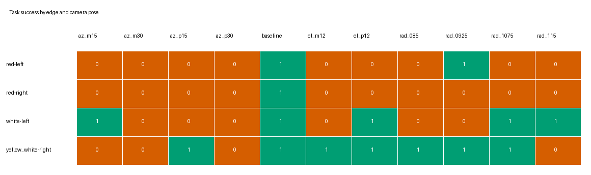
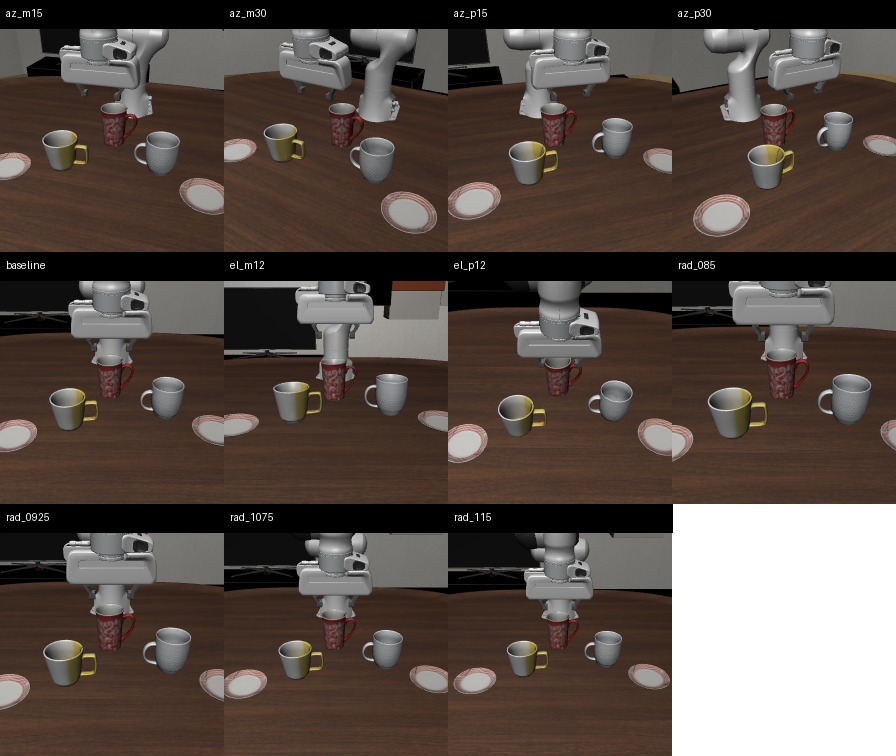
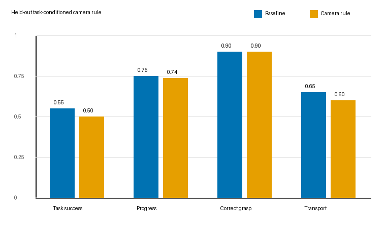

# LIBERO-Bind 相机视角敏感性与静态视角优化实验

## 研究问题

在不修改 Pi0.5 权重、动作执行方式或 wrist camera 的条件下，只改变外部
`agentview` 相机位姿，测量闭环任务成功率、子目标完成率与轨迹效率的变化，并
检验能否得到可泛化的静态最优视角。

## 实验控制

| 项目 | 固定设置 |
|---|---|
| Policy | Bridge-H20 seed 41, 33k updates |
| Benchmark | LIBERO-Bind 四条 action-supervised edges |
| Execution | fixed K=3, max 320 steps |
| Camera | 仅修改 `agentview` 6-DoF；wrist/FOV 不变 |
| Coarse sweep | azimuth `[-30,-15,0,15,30]°`；elevation `[-12,0,12]°`；radius `[0.85,0.925,1,1.075,1.15]x` |
| Selection | state 0 |
| Confirmation | states 1-4 |
| Frozen rule test | states 5-9 |

相机绕默认光轴与桌面 `z=0.48` 的交点旋转。所有位姿共享 checkpoint、初始
状态、语言、流采样 seed 和物理预算。操纵检查确认：baseline agent-view
MAE 为 0，扰动后的最小 MAE 为 9.78，全部 wrist-view MAE 为 0。

第一版实现曾在 `set_init_state` 后强制刷新 observables；第二版曾在 reset 前
设置相机。这两批分别被 baseline 复现门和图像哈希门否决，目录明确标记为
`invalid-*`，未进入任何统计。最终实现的插入点是 `reset` 后、
`set_init_state` 前。

## 粗扫结果

state 0 上 canonical baseline 为 4/4。所有非基线位姿均低于 baseline；最佳的
两个非基线候选是 `radius=0.925x` 与 `1.075x`，均为 2/4。方位角变化尤其
敏感：`±30°` 为 0/4，`±15°` 为 1/4。

响应显著依赖对象与任务。`white-left` 可容忍 `az=-15°`、`elev=+12°` 和较远
视角；`yellow_white-right` 在较近视角和较低 elevation 下明显更快；红杯任务
对方位角最敏感。

## 多状态确认

states 1-4 共 48 个 episode：

| Pose | Success | Progress | Capped steps | 相对 baseline 成功率 |
|---|---:|---:|---:|---:|
| baseline | 11/16 = 68.75% | 78.13% | 188.06 | - |
| radius 0.925x | 4/16 = 25.00% | 57.81% | 259.38 | -43.75 pp, paired 95% CI [-50.00, -31.25] |
| radius 1.075x | 8/16 = 50.00% | 70.31% | 258.13 | -18.75 pp, paired 95% CI [-37.50, 0.00] |

合并 states 0-4 后，baseline、0.925x、1.075x 分别为 15/20、6/20、10/20。
对应相对 baseline 的 paired state-group 差值为 -45 pp
`[-50,-35]` 和 -25 pp `[-45,-5]`。

存在一个局部正信号：在 `yellow_white-right` 上，0.925x 在 states 1-4 保持
4/4，并将平均成功步数从 142 降至 77.5；但同一位姿把 `white-left` 从 4/4
降为 0/4。因此不存在单一全局最优位姿。

## 静态任务条件规则

确认集上冻结规则：仅 `yellow_white-right` 使用 0.925x，其余任务保持
baseline。选择标准要求成功率不下降且成功步数至少减少 20%。随后只在未参与
搜索的 states 5-9 上评测。

| Policy | Success | Progress | Transport | Capped steps |
|---|---:|---:|---:|---:|
| baseline | 11/20 = 55% | 75.00% | 65% | 217.85 |
| task-conditioned camera | 10/20 = 50% | 73.75% | 60% | 220.15 |

规则相对 baseline 的成功率差为 -5 pp，paired state-group bootstrap 95% CI
`[-15,0]`。在 `yellow_white-right` 的三个共同成功状态上，近视角仍明显更快；
但它将另一个 baseline 成功状态变为失败，最终为 3/5 对 4/5。成功轨迹平均
步数下降不能抵消可靠性损失，也不能用 survivor-only 指标宣称优化成功。

## 结论

**KEEP_CANONICAL_CAMERA。** 对当前 Bridge-H20 checkpoint，canonical
agent-view 是平均成功率最优且最稳健的固定视角。当前证据不支持部署统一相机
偏移，也不支持任务条件静态相机规则。

实验同时揭示了可研究的问题：

1. 当前 Pi0.5 缺少外部视角等变性；仅 `15°` 方位变化即可大幅破坏对象绑定。
2. 视角响应是对象/任务条件化的，同一尺度变化可令一个对象更快、另一个对象失效。
3. 下一步应优化**模型的视角鲁棒性**，而不是继续搜索推理时相机：在训练中加入
   小幅 SE(3) 相机增强、显式 camera-extrinsic token，并以 canonical 成功率不降、
   曲线变平作为目标。

本结论仅覆盖一个 checkpoint、一个 LIBERO 场景和固定 K=3；它足以否决当前
“移动相机即可获得全局收益”的假设，但不是跨机器人或跨 benchmark 的普遍定律。

## 产物

- 原始 sweep：`/share/longjunyu/cabi-vla/camera-viewpoint-study-v1/bridge_h20_s41_state0_observed_k3_coarse_v3`
- 多状态确认：`/share/longjunyu/cabi-vla/camera-viewpoint-study-v1/bridge_h20_s41_states1to4_observed_k3_confirm_v1`
- held-out rule：`/share/longjunyu/cabi-vla/camera-viewpoint-study-v1/bridge_h20_s41_states5to9_camera_rule_holdout_v1`
- 位姿网格：[camera_pose_grid_v1.json](configs/camera_pose_grid_v1.json)
- 冻结规则：[task_conditioned_camera_rule_v1.json](configs/task_conditioned_camera_rule_v1.json)
- 机器可读摘要：[camera_viewpoint_study_v1_summary.json](camera_viewpoint_study_v1_summary.json)
- 视频全部为经 `libdav1d` 验证的 AV1/WebM，共 31 个。
