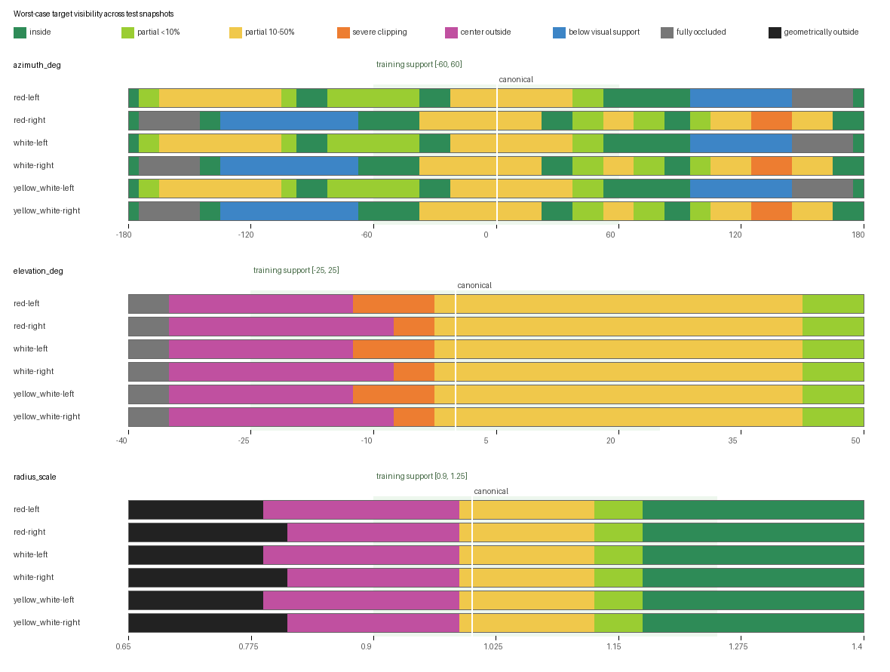
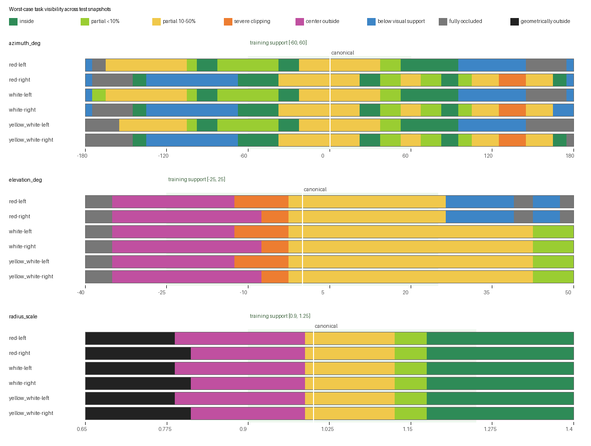
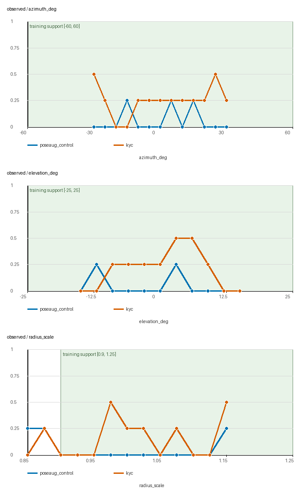
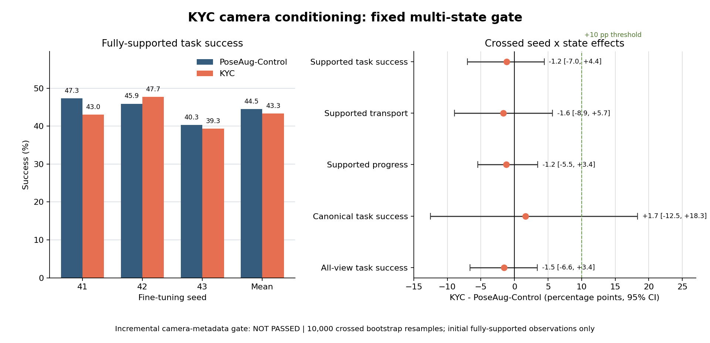

# KYC 相机条件化在 Pi0.5 / LIBERO-Bind 上的验证

## 结论

> **结论：`KYC_NOT_REPRODUCED`。** 在 fully-supported 初始观测上，
> PoseAug-Control 与 KYC 的跨 seed 成功率为 `44.49%` 与 `43.33%`：
> KYC 差 `1.16 pp`，crossed 95% CI 为 `[-7.03,+4.43] pp`。真实相机
> calibration 没有显示出超越匹配 RGB 增强和 canonical-ray 分支的增量价值。

相机位姿随机化本身有效：seed-41 的 PoseAug-RGB 为 `42.03%`，固定视角 Base
仅为 `12.89%`。但单状态 dense sweep 中 KYC 的局部正效应未跨状态或跨 seed
复现；因此不能把该局部曲线解释为稳健的 view-invariance 增益。

## 复现范围

本实验检验 [*Do You Know Where Your Camera Is?*](https://arxiv.org/abs/2510.02268)
（KYC）的相机条件化是否能在 AlphaBrain 的 CABI-enabled Pi0.5 上，提高外部
相机位姿变化下的闭环任务鲁棒性。实现依据包括
[项目页](https://ripl.github.io/know_your_camera/)与
[发布代码](https://github.com/ripl/CamPoseOpensource)。
它复现发布代码的 **Plücker late-fusion 拓扑**，不复现原论文的 SmolVLA、
robosuite/ManiSkill benchmark 或论文数值。

相机分支使用 OpenCV intrinsics 与 camera-to-world extrinsics 构造逐像素
`[direction, origin x direction]` Plücker ray map，经
`6→64→128→256→512→512` 五层 CNN、FrozenBN、ReLU、token-grid pooling 和
`512→1152` 投影后，与 projector 前的 SigLIP token 做无仿射 LayerNorm、
拼接及 `2304→1152` 融合。分支参数量为 7,172,736，与发布拓扑一致。只条件化
会移动的 `agentview`；wrist camera 固定。

发布仓库的 README 与 robosuite executable 对六通道顺序相反。本实验在训练前
冻结 README 的 `[direction, moment]` 顺序。新 CNN 从头训练，因此这是保留全部
几何信息的固定通道置换，但只能称拓扑级复现，不能称 bitwise reproduction。

## 因果对照

| Arm | 随机相机 RGB | 相机分支 | Ray input | 作用 |
|---|---:|---:|---|---|
| Base | 否 | 否 | 无 | 原始固定视角背景基线 |
| PoseAug-RGB | 是 | 否 | 无 | 纯图像增强背景对照 |
| PM-Fixed | 否 | 是 | canonical | 模块/参数量背景对照 |
| PoseAug-Control | 是 | 是 | canonical | 主 matched placebo |
| KYC | 是 | 是 | measured | 主方法 |

主因果比较是 **KYC vs PoseAug-Control**。两者逐 seed 共享初始化、22,464 条
RGB/action record、数据顺序、联合 crop、优化器、冻结模块、33,000 updates 和
评测 episode；唯一实验差异是真实 calibration 或 canonical calibration。
Base 与 PM-Fixed 的数据和训练暴露不完全匹配，只作背景解释。

三个微调 seed 均从同一个 Bridge-H20 seed-41 checkpoint 开始。统计因此只覆盖
微调随机性和十个 held-out 初始状态，不覆盖不同基础 checkpoint、任务总体、
任意相机姿态或 rollout seed。

## 视野边界

几何扫描覆盖六条 source-target edge、test states 40--49 和 78 个一因子位姿：

- azimuth：`-180°` 到 `180°`，边界附近加密；
- elevation：`-40°` 到 `50°`，边界附近加密；
- radius：`0.65x` 到 `1.40x`，近端以 `0.025x` 加密；
- 总计 4,680 个 scene record、9,360 个 object observation。

每个状态同时渲染正常场景和 isolated-object guard：

- `geometrically_out_of_view`：isolated-object 在传感器内投影像素为 0；
- `fully_occluded`：isolated-object 仍有传感器内投影，但正常场景可见像素为 0。

这避免把桌面/物体遮挡误报为“目标出了相机”。目标物体的 4,680 个观测中，
4,152 个有投影且可见，255 个有投影但完全不可见，273 个真正无传感器内投影。

图中每条色带取十个 test snapshot 的最坏情况；白线是 canonical，浅绿背景是
训练支持域。黑色才表示真正出传感器，灰色表示仍在传感器几何范围内但被完全
遮挡。离散网格上的关键边界如下：

| 扫描轴 | 左侧 target | 右侧 target | 解释 |
|---|---|---|---|
| Azimuth | `<4 patches` 于 `+100°`；完全遮挡于 `+150°` | `<4 patches` 于 `-75°`；完全遮挡于 `-150°` | 扫到 `±180°` 仍未真正出传感器 |
| Elevation | center-out 于 `-15°` | center-out 于 `-10°` | `-20°` 低于 patch 支持，`-36°` 完全遮挡；未真正出传感器 |
| Radius | 真正出传感器于 `≤0.775x` | 真正出传感器于 `≤0.800x` | `≤0.975x` 已 center-out/重裁切，`≤0.875x` 少于 4 patches，`≤0.825x` 少于 64 pixels |

任务成功同时需要 source 和 target，因此任务整体边界比只看 target 更严格：

`fully_supported` 只表示 rollout 开始时的 settled observation 同时满足：
两物体中心在框内、各至少 64 visible pixels 和 4 visible patches、几何裁切均
低于 50%。它不表示两物体在最长 320 步执行中始终完全可见。

## 密集响应

描述性 dense sweep 固定 seed 41、state 40，在 35 个细粒度位姿和四条任务边上
评测 KYC 与 PoseAug-Control，各 140 个 episode：

- azimuth：`[-30°,30°]`，步长 `5°`；
- elevation：`[-15°,15°]`，步长 `3°`；
- radius：`[0.85x,1.15x]`，步长 `0.025x`。

在 122 个初始观测 fully-supported episode 中：

| Metric | PoseAug-Control | KYC | Difference |
|---|---:|---:|---:|
| Full-task success | 4.92% | 22.13% | +17.21 pp |
| Transport success | 34.43% | 57.38% | +22.95 pp |
| Progress | 44.47% | 65.16% | +20.70 pp |

但 full-task success 增益高度集中在 `yellow_white-right`
（0/31 → 21/31）；`red-left` 为 6/30 → 6/30，另外两条边仍为 0。该曲线只有
一个初始状态，不能作为复现裁决，只说明进入固定多状态、多 seed gate 是合理的。

## 固定闭环 Gate

每个方法/seed 固定评测 13 个预先冻结的姿态、十个 unseen test snapshot 和四条
action-supervised task，共 520 个 episode；`K=3`、320 步、相同 flow/environment
seed、相同物理状态和相同 FOV join。九个产物均为 520 行且精确覆盖同一个笛卡尔
网格，总计 4,680 个闭环 episode、无重复键。

### 主比较

每个 seed 有 386 个 fully-supported episode；均值对 fine-tuning seed 和 held-out
snapshot 等权：

| Seed | PoseAug-Control | KYC | KYC - Control |
|---:|---:|---:|---:|
| 41 | 47.30% | 42.99% | -4.30 pp |
| 42 | 45.89% | 47.68% | +1.79 pp |
| 43 | 40.28% | 39.32% | -0.96 pp |
| **跨 seed** | **44.49%** | **43.33%** | **-1.16 pp** |

| Fully-supported metric | PoseAug-Control | KYC | Difference (95% CI) |
|---|---:|---:|---:|
| Full-task success | 44.49% | 43.33% | -1.16 pp `[-7.03,+4.43]` |
| Transport success | 59.29% | 57.65% | -1.64 pp `[-8.92,+5.66]` |
| Progress | 70.43% | 69.23% | -1.20 pp `[-5.49,+3.45]` |
| Capped completion steps ↓ | 233.74 | 234.78 | +1.04 `[-9.03,+11.84]` |

Canonical success 保持：Control `43.33%`、KYC `45.00%`，差
`+1.67 pp [-12.50,+18.33]`。但相对各自 canonical 的 supported non-canonical
变化为 Control `+1.29 pp`、KYC `-1.87 pp`；两者差
`-3.16 pp [-20.93,+10.43]`，没有 KYC 降低视角退化的证据。

### 局部性与对照

跨 seed 的 fully-supported 成功率差按移动轴分解为：

| Axis | KYC - Control |
|---|---:|
| Azimuth | -0.24 pp |
| Elevation | +1.73 pp |
| Radius | -7.83 pp |

State 40 在固定 gate 中仍为 `+7.89 pp`，但十个状态的差值范围为
`-8.77` 到 `+7.89 pp`。这解释了为何只使用 state 40 的 dense sweep 会给出强
正信号：效应局部存在，但状态异质性很大，尤其没有迁移到距离变化。真正几何
出视野的 stratum 中，KYC 反而差 `10.83 pp [-23.33,+0.83]`；缺失视觉证据时
相机 metadata 不能替代目标观测。

Seed-41 背景对照仅作解释，不作主因果结论：

| Arm | Fully-supported success |
|---|---:|
| Base | 12.89% |
| PM-Fixed | 29.03% |
| PoseAug-RGB | 42.03% |
| PoseAug-Control | 47.30% |
| KYC | 42.99% |

KYC 比 PoseAug-RGB 高 `0.96 pp`，但区间为 `[-10.56,+12.68] pp`。预注册四项
门槛中，canonical preservation 与这项严格正差通过；supported effect 和
behavioral success improvement 未通过，因此最终判定为
**`KYC_NOT_REPRODUCED`**。

## 解释边界

最终结论只回答：在这一个基础 checkpoint 和固定 LIBERO-Bind 任务/姿态集合中，
真实 pose-varying calibration 相对同架构 canonical-ray placebo 是否提供闭环增益。
由于没有 shuffled/mismatched-ray arm，本实验不能特异性证明 Plücker 几何优于
任何可能的 pose-varying side channel。若效果阈值达到 10 pp 但 CI 仍跨 0，只能
表述为“达到预注册实践阈值，区间仍包含零”，不能表述为统计显著。

## 产物

- 预注册：[kyc_camera_conditioning_preregistration.md](kyc_camera_conditioning_preregistration.md)
- FOV raw：`/share/longjunyu/cabi-vla/camera-viewpoint-study-v2/fov_guard_test40-49_v5`
- FOV analysis：`/share/longjunyu/cabi-vla/camera-viewpoint-study-v2/fov_guard_test40-49_v5_analysis_v3`
- Dense evaluation：`/share/longjunyu/cabi-vla/kyc-camera-eval-v1/dense`
- Fixed gate：`/share/longjunyu/cabi-vla/kyc-camera-eval-v1/gate`
- Cross-seed analysis v4：`/share/longjunyu/cabi-vla/kyc-camera-eval-v1/analysis/gate_seed_summary_final`
- AV1/WebM 与 contact sheets：各 seed-41 KYC/Control gate 的 `videos_av1/`
