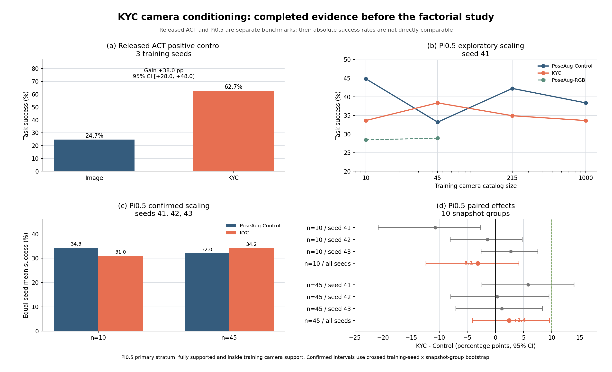
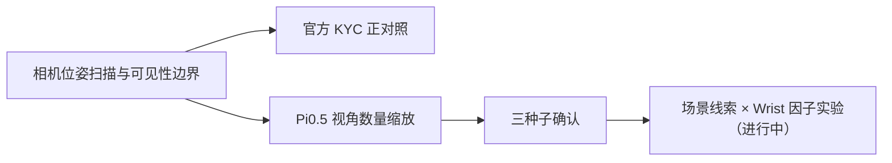

# KYC 相机条件化阶段研究报告

更新时间：2026-07-30
报告范围：仅汇总已经完成并通过校验的实验，不纳入仍在运行的
scene-cue × wrist-camera 因子实验。

## 一句话结论

KYC 在官方 ACT/RoboSuite 设置中产生了稳定且显著的相机外参泛化收益，
但其增益没有直接迁移到当前 Pi0.5 + LIBERO-Bind 的固定场景、wrist-on
设置；三种子确认结果表明，Pi0.5 在 10-view 和 45-view 训练预算下均未
获得可靠的显式相机几何增益。

这支持“官方机制有效，但对预训练 VLA 的增量价值依赖使用场景”的阶段
结论，不支持“KYC 论文无效”或“KYC 对所有 VLA 均无效”的泛化判断。

## 1. 研究问题

本研究围绕三个相互独立的问题展开：

1. 外部相机的方位、俯仰和距离变化是否会显著改变机器人策略表现？
2. KYC 发布代码在其原始 ACT/RoboSuite 设置中是否能产生正向结果？
3. 在 Pi0.5 中加入显式相机内外参后，是否能减少多视角训练数据需求？

第三个问题还包含两个待分离的混杂因素：

- 固定 LIBERO 房间、桌面和机器人底座可能让模型直接从 RGB 猜出相机位姿；
- wrist camera 不随外部相机移动，为策略提供了稳定的 robot-centric 视觉通道。

## 2. 已完成的实验

| Track | 实验 | 规模 | 状态 |
|---|---|---:|---|
| 0 | LIBERO 外部相机位姿扫描与 FOV 边界 | 13 个测试位姿 | 完成 |
| A | 官方 ACT Lift randomized：Image vs KYC | 2 方法 × 3 seeds | 完成 |
| B1 | Pi0.5 视角缩放：10/45/215/1000 views | 10 个模型 | 完成 |
| B2 | Pi0.5 低视角三种子确认：10/45 views | 8 个新模型 | 完成 |
| Diagnostic | 固定背景相机位姿泄漏 | 2,080 renders | 完成 |
| Diagnostic | KYC ray-use intervention | 48 paired inputs | 完成 |

累计完成：

- 官方 ACT 模型 6 个；
- Pi0.5 模型 18 个，每个训练 33,000 updates；
- Pi0.5 闭环评测 9,360 个 episodes；
- 官方成功/失败视频 120 个，已转为 AV1/WebM。

## 3. 数据与相机设计

### 3.1 训练数据

Pi0.5 使用同一批 LIBERO-Bind teacher action records。每个视角预算均为
67,392 条训练记录，底层动作、物理状态、记录顺序和 source hash 完全
一致。

相机训练范围：

| 变量 | 范围 |
|---|---:|
| Azimuth | [-60°, +60°] |
| Elevation offset | [-25°, +25°] |
| Radius scale | [0.90, 1.25] |
| 图像分辨率 | 224 × 224 |

相机目录采用 nested global catalog：

- `n={10,45,215,1000}` 的小目录始终是大目录的确定性前缀；
- 每条物理记录生成 3 个 deterministic epoch replicas；
- 相同预算下 Control、KYC 和 RGB 方法看到完全相同的像素；
- 不移动任务物体、碰撞几何、机器人运动学或动作坐标系。

### 3.2 方法对照

| 方法 | 多视角 RGB | 相机分支 | 分支输入 |
|---|---:|---:|---|
| PoseAug-RGB | 是 | 否 | 无 |
| PoseAug-Control | 是 | 是 | 固定 canonical rays |
| KYC | 是 | 是 | 真实 intrinsics/extrinsics 对应的 Plücker rays |

KYC 与 PoseAug-Control 具有相同的相机编码器、融合位置和参数量。因此，
两者差异隔离的是“真实相机几何是否提供增量信息”，不是数据增强或模型
容量差异。

## 4. Pi0.5 训练配置

所有 Pi0.5 方法严格共享：

| 项目 | 配置 |
|---|---|
| 主干 | PaliGemma + Pi0.5 action expert |
| 初始化 | 同一个 LIBERO-Bind Pi0.5 action-bridge checkpoint |
| 更新步数 | 33,000 |
| Per-device batch | 1 |
| Gradient accumulation | 2 |
| Optimizer | AdamW, betas=(0.9, 0.95) |
| Action head LR | 5e-5 |
| Scheduler | cosine with min LR |
| Warmup | 100 steps |
| 冻结模块 | `vlm_interface` |
| Action horizon | 20 |
| Flow inference steps | 10 |
| Action dimension | 7 |
| Wrist-on mask | `[true, true, false]` |
| Seeds | 41, 42, 43 |

相机条件分支仅作用于外部 `agentview`，使用 joint crop，并在 Control 与
KYC 之间保持完全相同的架构。

## 5. 闭环评测设计

每个 Pi0.5 模型固定评测：

- 4 个 action-supervised LIBERO-Bind task edges；
- 10 个 canonical snapshot groups，indices 40 至 49；
- 13 个外部相机位姿；
- 固定执行频率 `K=3`；
- 每个 episode 最多 320 steps；
- 共 `4 × 10 × 13 = 520` 个闭环 episodes；
- 相同初始状态、相机位姿、随机种子和 episode budget。

主要指标：

- full-task success；
- transport success；
- normalized progress；
- completion steps；
- canonical-view preservation；
- FOV visibility stratum。

主要统计单位是 snapshot group，而不是同一 group 内的帧或相机位姿。
单 seed 使用 paired group bootstrap；三 seed 结果同时重采样 training
seed 和相同 snapshot group，使用 crossed bootstrap 95% CI。

## 6. 场景线索诊断

为验证“固定背景可以泄漏相机位姿”，我们只保留背景、桌面等视觉资产，
在 held-out physical states 和 held-out scene seeds 上训练固定线性探针。

| 条件 | 13-way 位姿分类 | Mean positive R² |
|---|---:|---:|
| Fixed scene | 100.00% | 0.993 |
| Cue randomized | 60.68% | 0.656 |
| Chance | 7.69% | - |

分析：

- 固定场景背景足以完美分类 13 个相机位姿，说明 RGB 中存在极强的隐式校准线索；
- cue randomization 将分类优势降低 42.59%，mean positive R² 降低 33.88%；
- 仿真物理状态最大变化为 0，说明干预只改变渲染线索；
- cue-randomized 条件仍高于 chance，因为透视、物体投影和剩余几何仍包含相机信息。

该诊断通过预注册的 25% cue-suppression validity gate。

## 7. 官方 KYC 正对照

使用发布仓库 commit `e0647105`、发布数据和 pinned RoboSuite 环境，复现
ACT Lift randomized 的 Image-only 与 Plücker-conditioned KYC。

Held-out test cameras：

| Seed | Image | KYC | KYC - Image |
|---:|---:|---:|---:|
| 0 | 30% | 66% | +36 pp |
| 1 | 20% | 60% | +40 pp |
| 2 | 24% | 62% | +38 pp |
| Equal-seed mean | 24.67% | 62.67% | +38.00 pp |

三种子 paired hierarchical 95% CI 为 `[+28,+48]` pp。

结论：

- KYC 发布代码在其原始问题设置中产生稳定的大幅收益；
- 三个 seed 的方向完全一致；
- 本次 baseline 低于论文 aggregate，因此属于强正向 released-code control，
  不是逐数字完全复刻；
- 该结果排除了“KYC 机制本身不可运行或发布结果完全无法复现”的解释。

## 8. Pi0.5 Stage B1：单种子视角缩放

Seed 41：

| Views | Control | KYC | RGB | KYC - Control, 95% CI |
|---:|---:|---:|---:|---:|
| 10 | 44.83% | 33.62% | 28.45% | -10.73 pp [-21.22,-2.69] |
| 45 | 33.19% | 38.36% | 28.88% | +5.80 pp [-2.45,+13.98] |
| 215 | 42.24% | 34.91% | - | -7.40 pp [-14.56,+0.45] |
| 1000 | 38.36% | 33.62% | - | -4.53 pp [-9.73,+1.62] |

Control 的 success-vs-log-view AUC 为 0.3900，KYC 为 0.3564。曲线均不
单调，因此没有观察到 KYC 需要更少训练视角的证据。

45-view 的局部正值是唯一可能的 confirmation candidate，但低于预注册
的 10 pp practical threshold，且置信区间包含 0。

## 9. Pi0.5 Stage B2：三种子确认

预注册规则选择 10-view 与 45-view，并训练 seeds 42、43。

| Views | Equal-seed Control | Equal-seed KYC | 正式组级差异, 95% CI |
|---:|---:|---:|---:|
| 10 | 34.34% | 31.03% | -3.14 pp [-12.37,+4.14] |
| 45 | 32.04% | 34.20% | +2.41 pp [-4.05,+9.61] |

45-view 的每 seed 配对差异：

| Seed | KYC - Control |
|---:|---:|
| 41 | +5.80 pp |
| 42 | +0.31 pp |
| 43 | +1.11 pp |

Seed 41 的局部增益在 seeds 42/43 上明显收缩，三种子 CI 包含 0，且
上界未达到稳定的预注册 10 pp 效果门槛。

辅助指标同样没有可靠增益：

| Views | Transport 差异 | Progress 差异 |
|---:|---:|---:|
| 10 | -4.71 pp | -0.027 |
| 45 | +0.70 pp | +0.007 |

## 10. 已完成证据的阶段结论

### 能够支持

1. 外部相机变化是一个真实的策略分布偏移来源。
2. 固定场景 RGB 可以高度准确地编码相机位姿。
3. KYC 在官方 ACT/RoboSuite、无 wrist 的设计中具有显著效果。
4. 在当前 Pi0.5、固定场景、wrist-on 设置中，没有观察到稳定的 KYC
   增量价值或视角数据效率收益。
5. Pi0.5 的 45-view seed-41 正值属于未复现的探索性波动。

### 尚不能支持

1. 不能声称 KYC 论文造假或官方方法无效。
2. 不能声称显式相机几何对所有预训练 VLA 均无价值。
3. 不能判断 Pi0.5 的负结果主要来自固定背景、wrist side channel，还是
   预训练 VLA 已经从 RGB 隐式恢复了足够的相机信息。
4. 不能在 scene-cue × wrist 因子实验完成前给出最终
   `KYC_CONTEXT_DEPENDENT` 或
   `KYC_INCREMENTAL_GAIN_NOT_OBSERVED_ON_PI05` 判定。

当前最准确的结论标签是：

`KYC_INCREMENTAL_GAIN_NOT_OBSERVED_ON_PI05_LIBERO_BIND_FIXED_SCENE_WRIST_ON`

## 11. 可能机制解释

以下解释均与现有结果一致，但尚未完成因果区分：

- Pi0.5 的预训练视觉表示已经能从透视和背景中隐式恢复外部相机位姿；
- wrist camera 提供了不受外部相机干预影响的稳定机器人视角；
- late-fused ray branch 对已经形成的视觉表示影响较弱；
- 真实相机几何只在背景线索受抑制、wrist 关闭或训练视角更稀缺时有价值；
- ACT 的视觉容量和归纳偏置与 Pi0.5 不同，因此更依赖显式校准。

旧 checkpoint 的 ray intervention 也支持“相机分支利用不足”：

- correct rays 改为 canonical rays 后，action chunk RMS 仅 0.000710；
- action cosine similarity 约 0.999999；
- 模型并非数学上完全忽略 rays，但行为响应非常小。

## 12. 局限性

- Pi0.5 评测目前集中在 LIBERO-Bind 四个 action-supervised edges；
- 统计只有 10 个独立 snapshot groups，置信区间仍较宽；
- 当前初始化是统一的 LIBERO-Bind action-bridge checkpoint，不是从原始
  Pi0.5 base 重新进行完整任务训练；
- 当前固定 `K=3`，没有研究动态执行频率；
- 结果来自仿真，不直接等价于真实机器人相机误差；
- scene-cue × wrist 因子实验尚未完成。

## 13. 建议汇报结构

建议拆成 6 页：

1. 问题：外部相机变化造成 VLA 分布偏移。
2. 对照设计：RGB、capacity-matched Control、KYC。
3. 官方正对照：KYC `+38 pp`，证明方法在原设置有效。
4. Pi0.5 缩放：单 seed 局部增益未被三种子复现。
5. 背景泄漏：固定场景 100% 可猜相机位姿，说明存在 shortcut。
6. 当前结论与下一步：完成 scene × wrist 因子分解后再做最终裁决。

## 14. 关键材料位置

- 主结果图：
  `docs/cabi_vla/assets/kyc_camera_generalization_v2/completed_evidence.png`
- 场景线索图：
  `docs/cabi_vla/assets/kyc_camera_generalization_v2/scene_cue_leakage.png`
- 预注册：
  `docs/cabi_vla/kyc_camera_generalization_factorial_preregistration.md`
- Stage B1 summary：
  `/share/longjunyu/cabi-vla/kyc-scaling-v3/eval/stage-b1/analysis/stage_b1_scaling_summary.json`
- Stage B2 summary：
  `/share/longjunyu/cabi-vla/kyc-scaling-v3/eval/stage-b1/analysis/stage_b2_summary.json`
- 官方 ACT summary：
  `/share/longjunyu/kyc-official-data/runs/analysis/official_act_summary.json`
- 场景泄漏 summary：
  `/share/longjunyu/cabi-vla/kyc-scaling-v3/diagnostics/camera_pose_leakage_v2.json`
- 官方 AV1 视频 manifest：
  `/share/longjunyu/kyc-official-data/videos_av1_final/manifest.json`
