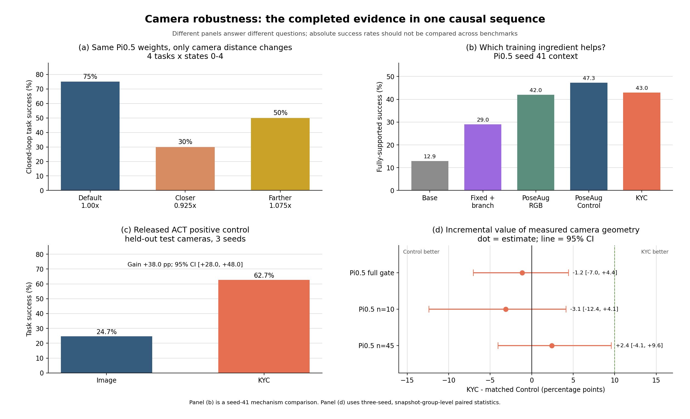
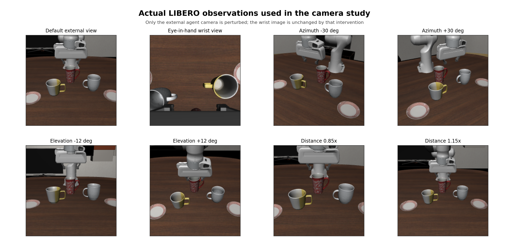
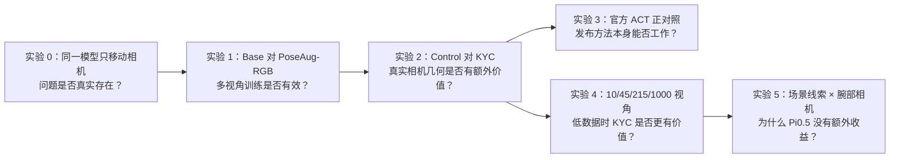
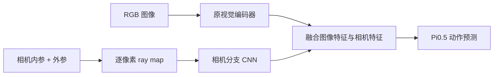
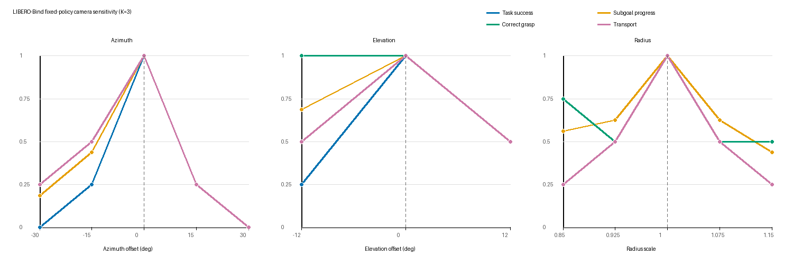
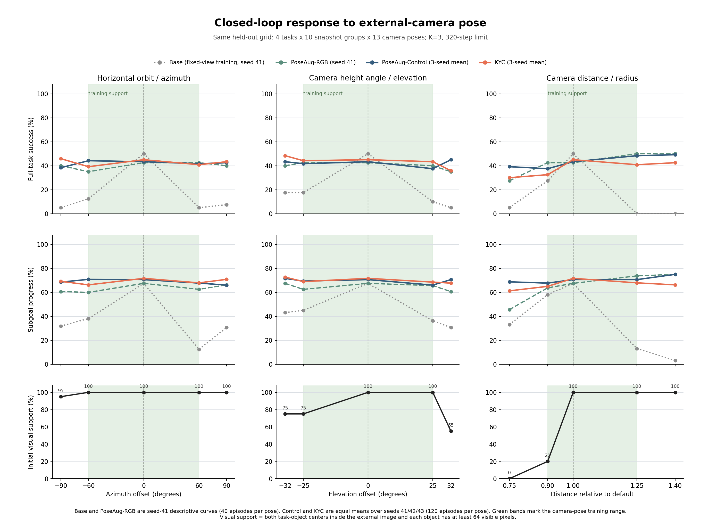
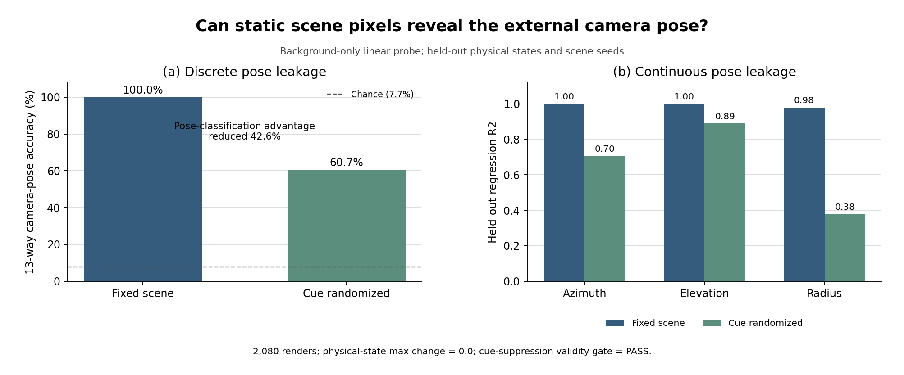

# 相机视角变化与 KYC 条件化阶段研究报告

更新时间：2026-07-30

报告范围：只汇总已经完成并通过校验的实验。仍在运行的
“场景线索 × 腕部相机”因子实验不计入当前结论。

## 0. 结论先行

这组实验不是单纯比较 KYC，而是按下面的因果顺序回答四个问题：

1. **相机移动是否真的会影响闭环任务？会，而且影响很大。**
   固定同一个 Pi0.5，不重新训练，只把外部相机距离改为默认距离的
   `0.925 倍`或`1.075 倍`，成功率便从 `75%` 分别降至 `30%` 和
   `50%`。在较小的初筛中，水平转动 `±30°` 会把 4 个任务的成功数从
   `4/4` 降至 `0/4`。
2. **多视角训练是否有帮助？有。**
   Seed 41 的机制对照中，固定视角训练的 Base 在变化视角下成功率为
   `12.89%`，加入随机相机图像训练后的 PoseAug-RGB 为 `42.03%`。
   主要收益来自“训练时见过多视角”。
3. **在相同多视角数据上，再显式告诉 Pi0.5 相机内外参是否更好？目前没有。**
   三种子完整 gate 中，KYC 为 `43.33%`，同架构的
   PoseAug-Control 为 `44.49%`；差异为 `-1.16 pp`，
   95% CI `[-7.03,+4.43] pp`。
4. **这是否说明 KYC 论文或实现无效？不是。**
   在官方 ACT/RoboSuite 设置中，KYC 将 held-out camera 成功率从
   `24.67%` 提升至 `62.67%`，增益 `+38 pp`，
   95% CI `[+28,+48] pp`。因此当前更合理的解释是：
   **KYC 有效，但其相对多视角 RGB 增强的增量价值依赖模型和观测设置。**

一句话总结：

> **视角变化确实是 Pi0.5 的严重问题；多视角图像增强明显缓解问题；但在当前
> 固定 LIBERO 场景且保留腕部相机的 Pi0.5 设置中，显式相机几何尚未显示出
> 超越匹配增强对照的稳定额外收益。**

下图把完整逻辑放在一处。四幅子图回答不同问题，不能跨 benchmark 直接比较
绝对成功率。

## 1. 原始机器人和相机是什么样

当前 Pi0.5 实验全部在 LIBERO/RoboSuite 仿真中完成，不是真机实验。
8 卡 RTX 5090 是训练计算设备，不是实验中的机器人硬件。

| 组件 | 当前实验设置 |
|---|---|
| 机器人 | Franka Emika Panda 七自由度机械臂，平行夹爪 |
| 外部相机 | `agentview`，安装在桌外的第三人称固定相机 |
| 腕部相机 | `robot0_eye_in_hand`，安装在机械臂末端，随手臂运动 |
| 图像输入 | 外部相机和腕部相机均为 `224 × 224 RGB` |
| 机器人状态 | 末端位置、末端姿态和夹爪状态，共 8 维 |
| 策略动作 | 7 维机器人动作，预测 horizon 为 20 |
| 闭环执行 | 每次执行 `K=3` 步后重新观察，单 episode 最多 320 步 |

默认外部相机：

- 垂直视场角为 `45°`；
- 相机到桌面注视点的距离约为 `0.908 m`；
- 相机位置约为 `(0.607, 0, 0.960) m`；
- 注视桌面上的固定点 `(-0.164, 0, 0.480) m`。

实验只移动外部 `agentview`。腕部相机不会因为外部相机被移动而改变，但它并非
固定在世界坐标中，而是随机器人末端一起运动。这也是它能够提供稳定
robot-centric 视觉信息的原因。

下图是真实送入实验的图像，不是示意渲染。第一行前两幅分别是默认外部相机和
腕部相机，其他图展示三种相机位姿变化。

## 2. 三个相机参数是什么意思

相机始终看向同一个桌面注视点。我们没有改变镜头焦距、图像分辨率、机器人、
物体或动作坐标系，只改变相机相对注视点的位置。

| 原字段 | 中文含义 | 直观解释 | 默认值 |
|---|---|---|---:|
| `Azimuth` | 水平方位角 | 相机围绕桌面向左或向右绕行，类似人在桌边横向换位置 | `0°` |
| `Elevation offset` | 俯仰/高度角偏移 | 相机沿球面升高或降低，同时继续看向同一桌面点 | `0°` |
| `Radius scale` | 相机距离倍率 | 相机到注视点的距离比例；小于 1 是靠近，大于 1 是远离 | `1.0×` |
| `FOV` | 镜头视场角 | 相机一次能看多宽；本实验固定为 `45°`，不是电子缩放 | 固定 |
| `Canonical` | 默认标准视角 | LIBERO 原本提供、原始模型最熟悉的相机位置 | `(0°,0°,1×)` |

训练时使用的相机范围：

| 参数 | 训练范围 | 对实际设置的含义 |
|---|---:|---|
| 水平方位角 | `[-60°, +60°]` | 最左到最右共跨越 120° |
| 俯仰角偏移 | `[-25°, +25°]` | 相对默认高度上下各改变 25° |
| 距离倍率 | `[0.90×, 1.25×]` | 约从 `0.817 m` 到 `1.135 m` |

这里的范围是**训练时随机生成相机视角的分布**，不是相机机械结构的极限。
直接敏感性实验采用更易解释的一因子扫描：一次只改变水平、俯仰或距离中的一个。

### 2.1 报告中常见英文和统计词

| 术语 | 中文解释 |
|---|---|
| `episode` | 从环境开始到任务成功或超时的一次完整闭环尝试 |
| `seed` | 训练随机种子；不同 seed 是独立重复训练，用来排除偶然波动 |
| `held-out` | 训练时没有使用、专门留作测试的数据或相机 |
| `pp` | 百分点；例如成功率从 30% 到 40% 是提升 10 pp |
| `95% CI` | 95% 置信区间；差值区间跨过 0 时，当前数据不能确定谁稳定更好 |
| `gate` | 事先规定好方法、样本和判据的正式确认实验 |
| `ray / rays` | 从相机光心穿过每个像素的三维射线，编码相机在哪里、像素朝哪个方向看 |
| `fully-supported` | 初始时源物体和目标物体都足够可见，且相机位姿位于训练支持范围内 |
| `horizon=20` | 模型一次预测未来 20 个动作 |
| `K=3` | 闭环中只执行前 3 个动作，然后重新拍图并再次推理 |

## 3. 整套实验为什么分成这些组

实验顺序如下：

### 3.1 五个训练组的区别

| 组别 | 训练图像 | 相机分支 | 分支收到的信息 | 回答的问题 |
|---|---|---|---|---|
| Base | 只有默认固定视角 | 无 | 无 | 原模型遇到相机变化有多脆弱 |
| PM-Fixed | 只有默认固定视角 | 有 | 固定默认 rays | 只增加模块容量是否有影响 |
| PoseAug-RGB | 随机多视角 | 无 | 无 | 单纯多视角图像增强是否有效 |
| PoseAug-Control | 与 KYC 完全相同的随机多视角 | 有 | 永远使用固定默认 rays | 匹配 KYC 的参数量和网络结构 |
| KYC | 与 Control 完全相同的随机多视角 | 有 | 每张图真实的相机 rays | 显式相机几何是否提供额外信息 |

最重要的公平比较是：

> **KYC vs PoseAug-Control**

这两组使用相同初始化、图像、动作、样本顺序、优化器、更新步数和相机分支。
唯一差异是分支收到“真实相机几何”还是“永远不变的默认几何”。

因此：

- Base vs PoseAug-RGB 回答“多视角数据增强有没有用”；
- PoseAug-Control vs KYC 回答“知道真实相机在哪里有没有额外用”；
- 直接拿 Base 与 KYC 比较会把数据增强、模块容量和相机几何混在一起，不能
  归因于 KYC。

### 3.2 相机分支和 ray map 到底是什么

Pi0.5 原本主要看到 RGB 图像。相机分支是额外加入的一条小网络，专门读取相机
几何，而不是读取另一张照片：

相机参数分为：

- **内参 intrinsics**：焦距、图像中心等，说明三维方向怎样投影到像素；
- **外参 extrinsics**：相机在世界中的位置和朝向。

对图像中的每个像素，都可以从这些参数算出一条三维观察射线。它表示：

> 相机光心在哪里，以及从相机穿过这个像素时朝哪个三维方向看。

因此 ray map 是一个与图像同高同宽的六通道数值张量。每个像素包含：

- 三维方向 `d=(dx,dy,dz)`；
- Plücker moment `m=o×d`，其中 `o` 是相机光心；
- 合起来写作 `[d,m]`，能够表示这条三维直线的位置和方向。

它的目标是解决下面的歧义：同一个杯子在不同相机下会落到完全不同的像素位置，
而相同像素位置在不同相机下也可能对应不同的世界方向。RGB-only 策略容易把
“图像坐标”误当作固定的“世界坐标”；ray map 则告诉模型每个像素对应哪条
世界观察射线，理论上有助于把视觉目标重新对齐到机器人世界坐标。

但 ray map **不包含深度**，也不能让模型看到被遮挡或已经出画面的物体。它必须
与 RGB 中的物体外观和机器人状态共同使用，才能推断物体可能位于射线上的哪里。
当前实现只给会移动的外部 `agentview` 加 ray map，没有给腕部相机加该分支。

KYC 和 PoseAug-Control 的相机分支结构完全相同：

| 方法 | 相机分支收到什么 | 能检验什么 |
|---|---|---|
| PoseAug-Control | 所有图像都配同一张默认相机 ray map | 额外 CNN、参数量和固定空间编码本身的作用 |
| KYC | 每张图都配自己真实相机位姿生成的 ray map | 真实相机几何在匹配架构之外是否还有增量价值 |

所以当前结果说明的不是“视角问题不存在”，而是：

> 在视角问题明确存在、多视角增强也明确有效的前提下，当前 Pi0.5 没有表现出
> 对真实 ray map 的稳定额外利用。

可能原因包括 RGB 背景已经泄漏相机位置、腕部相机提供稳定参照、融合位置较晚，
或者预训练表示不容易在当前训练量下学会使用新加入的几何分支。官方 ACT 正对照
明显受益，说明 ray map 的思想本身并非无效。

### 3.3 已完成实验规模

| 实验 | 已完成规模 |
|---|---:|
| 固定策略相机敏感性 | 132 个有效闭环 episodes，31 个 AV1 视频 |
| 宽范围视野和遮挡扫描 | 4,680 个场景渲染，9,360 个目标观测 |
| Pi0.5 首轮 KYC 完整 gate | 9 个评测产物，共 4,680 个闭环 episodes |
| 官方 ACT 正对照 | 6 个模型，3 seeds，120 个 AV1/WebM 成功/失败视频 |
| Pi0.5 视角数量缩放 B1/B2 | 18 个模型，每个训练 33,000 updates，共 9,360 个闭环 episodes |
| 固定背景位姿泄漏诊断 | 2,080 个渲染 |

## 4. 实验 0：视角变化本身怎样影响闭环成功率

这个实验固定同一个 Bridge-H20 Pi0.5 checkpoint、初始状态、语言指令、
动作采样 seed、执行频率和最大步数，只移动外部相机。

### 4.1 初始粗扫

State 0 上共有 4 个物体搬运任务。默认相机为 `4/4` 成功：

| 改动 | 闭环成功 | 相对默认视角 |
|---|---:|---:|
| 默认视角 | `4/4 = 100%` | - |
| 水平 `-30°` | `0/4 = 0%` | `-100 pp` |
| 水平 `-15°` | `1/4 = 25%` | `-75 pp` |
| 水平 `+15°` | `1/4 = 25%` | `-75 pp` |
| 水平 `+30°` | `0/4 = 0%` | `-100 pp` |
| 俯仰 `-12°` | `1/4 = 25%` | `-75 pp` |
| 俯仰 `+12°` | `2/4 = 50%` | `-50 pp` |
| 距离 `0.925×` | `2/4 = 50%` | `-50 pp` |
| 距离 `1.075×` | `2/4 = 50%` | `-50 pp` |

图的读法：

- 横轴分别是水平角、俯仰角和距离倍率；
- 竖直虚线是默认视角；
- 蓝线是完整任务成功率；
- 其他线是抓取、运输和阶段进度；
- 这里每个点只有 4 个任务，用于筛选候选，不作为最终统计。

### 4.2 多初始状态确认

将粗扫中最好的两个非默认距离候选扩展到 states 0 至 4：

| 相机距离 | 20 个闭环 episode 成功率 | 相对默认 |
|---|---:|---:|
| 默认 `1.0×` | `15/20 = 75%` | - |
| 靠近 `0.925×` | `6/20 = 30%` | `-45 pp` |
| 远离 `1.075×` | `10/20 = 50%` | `-25 pp` |

在独立的 states 1 至 4 确认集上：

- `0.925×` 相对默认下降 `43.75 pp`，95% CI `[-50,-31.25]`；
- `1.075×` 相对默认下降 `18.75 pp`，95% CI `[-37.5,0]`。

也发现局部例外：靠近相机能让 `yellow_white-right` 的成功轨迹更快，但会让
`white-left` 从 `4/4` 降至 `0/4`。因此视角影响取决于物体和任务，没有一个
偏移视角能对所有任务都更好。

在完全独立的 states 5 至 9 上，任务条件静态相机规则成功率为 `50%`，默认
相机为 `55%`。最终结论是 `KEEP_CANONICAL_CAMERA`：当前不应在推理时寻找一个
新的固定最佳相机，而应训练模型对视角变化更鲁棒。

### 4.3 物体什么时候真的离开视野

我们另外扫描了更宽的几何范围，共 4,680 个场景渲染：

| 变化轴 | 可见性边界 |
|---|---|
| 水平方位角 | 扫到 `±180°` 仍未出现严格的“几何投影完全离开传感器”；通常先发生遮挡或目标只剩很少图像 patches |
| 俯仰角 | 在 `[-40°, +50°]` 中也没有严格离开传感器；低视角会先出现中心出框、裁切和遮挡 |
| 相机距离 | 左侧目标在约 `≤0.775×`、右侧目标在约 `≤0.800×` 时真正完全出传感器 |

这说明闭环成功率下降不只是因为“物体完全看不见”。例如水平移动 `15°` 时，
物体通常仍在图像中，但成功率已经明显下降。更可能的问题包括：

- 物体在图像中的位置和大小改变；
- 机器人、源物体和目标物体的相对投影改变；
- 预训练策略对默认背景和默认几何形成了视觉 shortcut；
- 视觉表示没有充分学习相机变化下的对象绑定和空间等变性。

### 4.4 扩展到 10 个测试状态的三轴闭环响应曲线

旧粗扫曲线只使用 state 0，每个位姿只有 4 个任务。下面的新图使用统一的
held-out 测试网格：

- 4 个任务；
- 10 个训练时未见过的 snapshot groups；
- 13 个冻结相机位姿；
- Base 和 PoseAug-RGB 每个位姿 40 个 episodes；
- PoseAug-Control 和 KYC 对 seeds 41/42/43 等权平均，每个位姿共
  120 个 episodes。

这里 Base 默认视角为 `50%`，而前面 states 0 至 4 的确认结果为 `75%`，
原因是本图改用了更难且完全独立的 test states 40 至 49；两者不是同一批
初始状态，不能把绝对成功率直接相减。

图的读法：

- 三列分别是水平方位角、俯仰角和相机距离；
- 第一行是完整任务成功率；
- 第二行是平均子目标完成进度；
- 第三行是初始外部图像的视觉支持率；
- 黑色虚线是默认相机；
- 浅绿色区域是训练时使用的相机位姿范围；
- 灰色点线是固定视角训练的 Base；
- 绿色虚线是只做多视角图像增强的 PoseAug-RGB；
- 蓝线和橙线分别是三种子 PoseAug-Control 与 KYC。

这里的“视觉支持”定义为：源物体和目标物体中心都在外部图像内，而且每个物体
至少有 64 个可见像素。它用于区分“模型因视角变化失败”和“外部相机已经基本
看不到任务物体”。

#### 主要曲线结论

1. **固定视角 Base 对默认相机高度过拟合。**
   默认视角成功率为 `50%`；水平角改变后只有 `5%` 至 `12.5%`，
   俯仰边界为 `10%` 至 `17.5%`，距离 `1.25×/1.40×` 时为 `0%`。
2. **水平角退化不是因为物体离开画面。**
   从 `-90°` 到 `+90°`，视觉支持率仍为 `95%` 至 `100%`，但 Base 成功率
   从默认的 `50%` 跌至 `5%` 至 `12.5%`。这直接证明模型对投影、背景和对象
   空间关系的变化敏感。
3. **多视角 RGB 增强显著拉平曲线。**
   在绿色训练范围内，Base 成功率的最大减最小振幅分别为：
   水平 `45 pp`、俯仰 `40 pp`、距离 `50 pp`；PoseAug-RGB 降至
   `7.5 pp`、`2.5 pp`、`7.5 pp`。
4. **Control 与 KYC 都已较为平坦，但 KYC 没有一致更平。**
   Control 的三轴振幅为 `2.5/5.83/10.83 pp`，KYC 为
   `5.83/1.67/12.5 pp`。KYC 在俯仰轴略平，但在水平和距离轴不优于
   matched Control，不能形成稳定几何增益结论。
5. **极近距离需要单独解释。**
   `0.75×` 时外部图像视觉支持率为 `0%`，所以该点主要测量腕部相机和先验能否
   在外部视觉证据缺失时维持任务，不是纯粹的相机几何泛化。
6. **绿色区域外是压力测试。**
   `±90°`、`±32°`、`0.75×` 和 `1.40×` 超出训练相机范围，只用于描述
   外推行为；正式 KYC 因果比较仍以预注册的支持范围和可见性分层为准。

这张图给出的核心结论比“某个相机位姿成功率是多少”更重要：

> 当前模型的视角问题是真实且可测的；多视角训练已经解决了大部分曲线尖峰；
> 剩余问题是如何获得更稳健的三维空间归纳偏置，而不是简单把真实相机参数再
> 输入一次。

## 5. 实验 1 和 2：多视角增强有效，KYC 的额外价值未出现

### 5.1 Seed 41 机制对照

在相同的 fully-supported 评测范围内：

| 方法 | 成功率 | 主要变化 |
|---|---:|---|
| Base | `12.89%` | 固定视角训练，无相机分支 |
| PM-Fixed | `29.03%` | 固定视角训练，增加相机分支 |
| PoseAug-RGB | `42.03%` | 加入随机多视角图像 |
| PoseAug-Control | `47.30%` | 多视角图像 + 固定假 rays |
| KYC | `42.99%` | 多视角图像 + 真实 rays |

最稳妥的机制解释是：

1. 从 Base 到 PoseAug-RGB 提升约 `29.14 pp`，说明多视角图像训练很重要；
2. PoseAug-Control 和 KYC 都高于 Base，不能据此把收益归因于真实相机几何；
3. 在这个 seed 上，真实 rays 甚至没有超过同架构的固定 rays 对照；
4. 该表只有一个微调 seed，主要用于解释机制，最终判断使用下面的三种子比较。

### 5.2 三种子完整闭环 gate

每个方法、每个 seed 固定评测：

- 4 个 LIBERO-Bind 搬运任务；
- 10 个未见过的 snapshot groups；
- 13 个冻结的外部相机位姿；
- 共 520 个闭环 episodes；
- `K=3`，每个 episode 最多 320 步。

三种子 fully-supported 主结果：

| 指标 | PoseAug-Control | KYC | KYC - Control |
|---|---:|---:|---:|
| 完整任务成功率 | `44.49%` | `43.33%` | `-1.16 pp [-7.03,+4.43]` |
| 搬运成功率 | `59.29%` | `57.65%` | `-1.64 pp [-8.92,+5.66]` |
| 阶段进度 | `70.43%` | `69.23%` | `-1.20 pp [-5.49,+3.45]` |
| 完成步数，越低越好 | `233.74` | `234.78` | `+1.04 [-9.03,+11.84]` |

所有主要区间都跨过 0，没有稳定方向。默认标准视角也没有明显退化：
Control 为 `43.33%`，KYC 为 `45.00%`。

## 6. 实验 3：官方 KYC 正对照

使用发布仓库 commit `e0647105`、发布数据和 pinned RoboSuite 环境，评测
ACT Lift randomized。这个设置不使用腕部相机，更接近论文原问题。

| Seed | Image-only | KYC | KYC - Image |
|---:|---:|---:|---:|
| 0 | `30%` | `66%` | `+36 pp` |
| 1 | `20%` | `60%` | `+40 pp` |
| 2 | `24%` | `62%` | `+38 pp` |
| 三种子均值 | `24.67%` | `62.67%` | `+38 pp` |

三种子 paired hierarchical 95% CI 为 `[+28,+48] pp`。三个 seed 方向完全
一致，说明发布 KYC 在其原始 ACT/无腕部相机设置中确实有效。

本次 Image baseline 低于论文 aggregate，因此它是强正向 released-code
control，不是论文每个数字的逐项完全复刻。

## 7. 实验 4：训练视角少时，KYC 是否更有价值

这里的 `n=10/45/215/1000` 指**训练集中独立相机位姿目录的大小**，不是训练
图像总数。所有预算都保持 67,392 条训练记录、相同动作、相同训练步数；只改变
这些记录复用了多少种不同相机位置。

Seed 41 的完整探索曲线没有单调关系：

| 独立训练视角数 | Control | KYC | KYC - Control |
|---:|---:|---:|---:|
| 10 | `44.83%` | `33.62%` | `-10.73 pp` |
| 45 | `33.19%` | `38.36%` | `+5.80 pp` |
| 215 | `42.24%` | `34.91%` | `-7.40 pp` |
| 1000 | `38.36%` | `33.62%` | `-4.53 pp` |

因为 45-view 出现局部正值，我们预先选定 10 和 45 views 进行三种子确认：

| 视角数 | Control 三种子均值 | KYC 三种子均值 | 正式组级差异，95% CI |
|---:|---:|---:|---:|
| 10 | `34.34%` | `31.03%` | `-3.14 pp [-12.37,+4.14]` |
| 45 | `32.04%` | `34.20%` | `+2.41 pp [-4.05,+9.61]` |

45-view 的每 seed 差异是 `+5.80`、`+0.31`、`+1.11 pp`。Seed 41 的局部
正值在 seeds 42 和 43 上明显收缩。当前没有证据表明 KYC 能用更少相机视角
达到同样性能。

### 7.1 新主图第四幅如何阅读

主图 (d) 是“效应与置信区间图”：

- 每个圆点表示 `KYC 成功率 - PoseAug-Control 成功率`；
- 圆点在 0 左侧表示 Control 更高，在 0 右侧表示 KYC 更高；
- 横线表示 95% 置信区间；
- 横线跨过黑色 `0` 线，表示当前数据不能确定真实差异方向；
- 绿色虚线 `+10 pp` 是预注册的实践效果门槛；
- `Pi0.5 full gate`、`n=10` 和 `n=45` 三条区间全部跨 0，且没有稳定达到
  `+10 pp`。

旧图把每个 seed 和综合结果都堆在第四幅中，信息过密。新版只保留三个正式
综合效应，每个 seed 的详细数字留在表格中。

## 8. 为什么 Pi0.5 与官方 ACT 结果不同

目前已经确认一个重要混杂因素：固定 LIBERO 场景本身会泄漏相机位姿。

只使用背景、桌面等视觉像素训练线性探针：

| 场景条件 | 13 类相机位姿分类 | 连续位姿 mean positive R² |
|---|---:|---:|
| 固定场景 | `100.00%` | `0.993` |
| 视觉线索随机化 | `60.68%` | `0.656` |
| 随机猜测 | `7.69%` | - |

也就是说，在固定场景里，即使不给模型显式相机参数，模型仍可从墙面、桌边、
机器人底座和透视关系中猜出相机位置。Pi0.5 还有一个腕部相机，能够提供不受
外部相机移动影响的视觉通道。官方 ACT 正对照没有腕部相机，这两点都会降低
显式相机几何的边际价值。

但这仍只是解释，不是最终因果结论。因此当前正在进行严格的 `2 × 2` 因子实验：

| 因子 | 条件 1 | 条件 2 |
|---|---|---|
| 场景线索 | 固定房间、桌面和背景 | 随机化纯视觉房间线索，物理状态不变 |
| 腕部相机 | 保留 wrist 输入 | 屏蔽 wrist 输入 |

每个单元都比较 PoseAug-Control 与 KYC。只有这组实验完成后，才能判断 KYC
是否主要在“背景不能泄漏相机位置且没有稳定腕部视角”的条件下产生价值。

## 9. 当前能够和不能够下的结论

### 已经能够支持

1. 外部相机变化会显著降低当前 Pi0.5 的闭环成功率。
2. 下降在目标仍可见时就会发生，不只是目标彻底出视野造成的。
3. 多视角 RGB 数据增强显著优于固定视角训练。
4. 官方 KYC 在 ACT/RoboSuite、无腕部相机设置中具有稳定显著效果。
5. 当前 Pi0.5、固定 LIBERO 场景、腕部相机开启时，没有观察到 KYC 相对
   matched Control 的稳定增量价值或训练视角数据效率收益。

### 目前不能支持

1. 不能声称 KYC 论文造假或发布方法无效。
2. 不能声称相机外参对所有预训练 VLA 都没有价值。
3. 不能把 Seed 41 某个局部视角或任务上的正值称为稳健增益。
4. 因子实验完成前，不能确定负结果主要来自背景 shortcut、腕部相机，
   还是 Pi0.5 表示本身已经足够隐式地编码相机位置。

当前最准确的阶段标签是：

`KYC_INCREMENTAL_GAIN_NOT_OBSERVED_ON_PI05_LIBERO_BIND_FIXED_SCENE_WRIST_ON`

## 10. 建议的汇报顺序

建议按 6 页讲，不再按文件或实验时间顺序讲：

1. **实验系统与术语**：Panda、外部相机、腕部相机，解释水平角、俯仰角和距离。
2. **问题确实存在**：同一模型只移动相机，成功率从 75% 降到 30%/50%。
3. **什么已经有效**：Base 12.89%，PoseAug-RGB 42.03%，多视角增强是主收益。
4. **KYC 公平比较**：KYC 与同结构 Control 三种子没有稳定差异。
5. **方法不是坏的**：官方 ACT 正对照稳定 `+38 pp`。
6. **为什么不同与下一步**：固定背景 100% 泄漏相机位置，腕部相机可能提供
   side channel；等待 scene × wrist 因子实验。

## 11. 关键材料

- 本报告主图：
  `docs/cabi_vla/assets/kyc_camera_generalization_v3/camera_robustness_story.png`
- 三轴视角响应曲线：
  `docs/cabi_vla/assets/kyc_camera_generalization_v3/camera_pose_response_curves.png`
- 三轴曲线机器摘要：
  `docs/cabi_vla/assets/kyc_camera_generalization_v3/camera_pose_response_summary.json`
- 实际相机观测：
  `docs/cabi_vla/assets/kyc_camera_generalization_v3/camera_setup_examples.png`
- 固定策略相机敏感性：
  `docs/cabi_vla/camera_viewpoint_sensitivity_study.md`
- KYC 三种子完整 gate：
  `docs/cabi_vla/kyc_camera_conditioning_validation.md`
- 因子实验预注册：
  `docs/cabi_vla/kyc_camera_generalization_factorial_preregistration.md`
- 视角敏感性机器摘要：
  `docs/cabi_vla/camera_viewpoint_study_v1_summary.json`
- KYC 完整 gate 机器摘要：
  `docs/cabi_vla/kyc_camera_study_v1_result.json`
- 官方 ACT summary：
  `/share/longjunyu/kyc-official-data/runs/analysis/official_act_summary.json`
- 官方成功/失败 AV1 视频：
  `/share/longjunyu/kyc-official-data/videos_av1_final/manifest.json`
