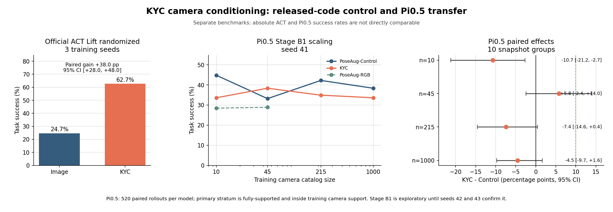

# KYC Camera Generalization: Interim Results

Status: official ACT positive control complete; Pi0.5 Stage B1 complete; Stage
B2 and the scene-cue by wrist factorial are running.

## Questions

This study keeps three claims separate:

1. Does the released KYC implementation work in its ACT/RoboSuite setting?
2. Does explicit camera geometry improve Pi0.5 view-count scaling?
3. Are fixed-scene cues or the wrist stream masking a Pi0.5 benefit?

The current results answer the first question and provide a single-seed
estimate for the second. They do not yet answer the third.

## Released-Code Positive Control

The released ACT Lift randomized experiment was run with Image and KYC models
for seeds 0, 1, and 2, using the pinned repository and RoboSuite versions.

| Camera set | Image | KYC | Paired gain | Hierarchical 95% CI |
|---|---:|---:|---:|---:|
| Held-out test cameras | 24.67% | 62.67% | +38.00 pp | [+28.00, +48.00] |
| Training cameras | 25.33% | 66.00% | +40.67 pp | [+29.33, +52.00] |

Every seed had a positive test-camera gain: +36, +40, and +38 percentage
points. This is a strong released-code positive control. It reproduces the
reported direction and a large effect, although it is not an exact numerical
reproduction of the paper's aggregate because the image-only baseline is
lower in this run.

Artifact:
`/share/longjunyu/kyc-official-data/runs/analysis/official_act_summary.json`.

## Pi0.5 Stage B1

Stage B1 compares measured rays (`KYC`) with a capacity-matched branch supplied
constant canonical rays (`PoseAug-Control`). Both methods receive identical
rendered RGB and training records at each camera-catalog budget. Results below
use seed 41 and the preregistered primary evaluation stratum.

| Views | PoseAug-Control | KYC | PoseAug-RGB | KYC - Control, paired 95% CI |
|---:|---:|---:|---:|---:|
| 10 | 44.83% | 33.62% | 28.45% | -10.73 pp [-21.22, -2.69] |
| 45 | 33.19% | 38.36% | 28.88% | +5.80 pp [-2.45, +13.98] |
| 215 | 42.24% | 34.91% | - | -7.40 pp [-14.56, +0.45] |
| 1000 | 38.36% | 33.62% | - | -4.53 pp [-9.73, +1.62] |

The success-versus-log-view-count AUC is 0.3900 for Control and 0.3564 for KYC.
Both methods reach 80% of their observed maximum at 10 views because neither
curve is monotonic. Stage B1 therefore provides no evidence that KYC improves
Pi0.5 camera-data efficiency.

The local 45-view gain is the only positive KYC-Control estimate. It is below
the preregistered 10-point practical threshold, its interval includes zero,
and it is heterogeneous across physical state groups and camera axes. It is a
confirmation candidate, not a positive result.

Artifact:
`/share/longjunyu/cabi-vla/kyc-scaling-v3/eval/stage-b1/analysis/stage_b1_scaling_summary.json`.

## Evaluation Audit

- Every Stage B1 model has 520 unique paired closed-loop episodes.
- Episode keys are identical across methods and camera budgets.
- Statistical inference uses 10 canonical snapshot groups, not rollout frames.
- The gate contains only action-supervised camera edges, so its data split is
  correctly `observed` only; no withheld-state claim is made.
- The official ACT and Pi0.5 success rates are from different benchmarks and
  must not be compared as absolute model capability.

## Interim Interpretation

The official positive control rules out the broad claim that KYC is ineffective
or that the released mechanism cannot be reproduced. The Pi0.5 result instead
poses a transfer question: a pretrained VLA may already infer camera geometry
from RGB, use the invariant wrist stream, or fail to optimize the added ray
branch strongly enough for explicit calibration to add value.

Stage B2 mechanically confirms 10 and 45 views with seeds 42 and 43. The
subsequent preregistered factorial compares fixed versus cue-randomized scenes
and wrist on versus off. Only those results can distinguish a
context-dependent Pi0.5 benefit from a genuine failure of incremental transfer.

No final KYC-on-Pi0.5 decision is made at this stage.
