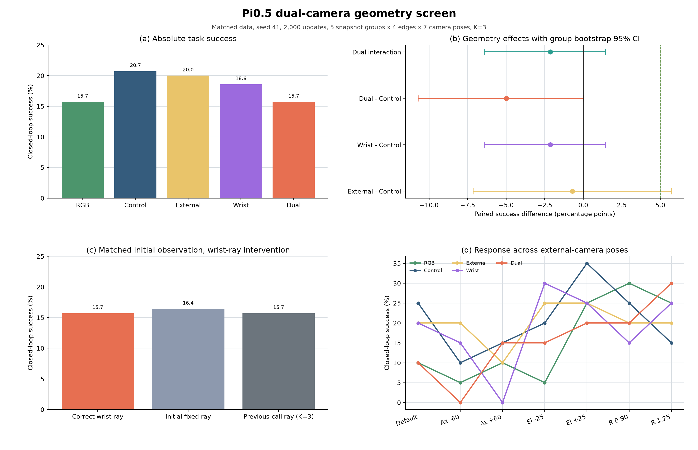
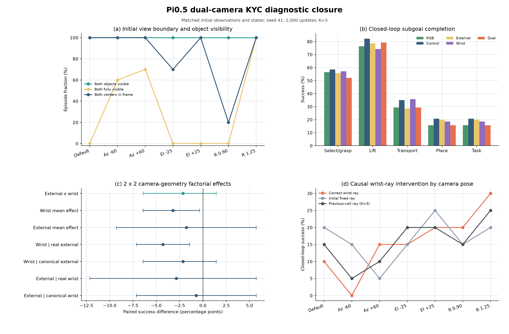
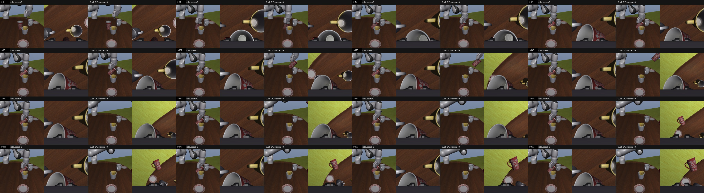
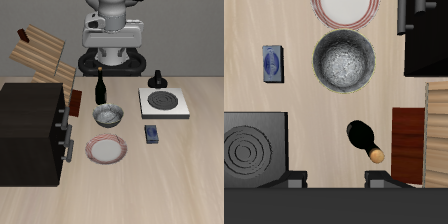

# KYC × Pi0.5 双相机闭环验证结果

更新时间：2026-08-03

## 结论摘要

本轮直接回答了此前未覆盖的问题：

> 在同时保留第三人称相机和动态腕部相机的 Pi0.5 中，给两个视角输入实时真实
> ray map，是否比同容量固定 ray Control 更好？

预注册裁决为：

> **DO_NOT_ADVANCE_FROM_DUAL_CAMERA_SCREEN**

主要结果如下：

- Control（双相机同容量基线）闭环成功率为 `20.71%`，baseline 有效；
- External-KYC 为 `20.00%`，相对 Control `-0.71 pp`；
- Wrist-KYC 为 `18.57%`，相对 Control `-2.14 pp`；
- Dual-KYC 为 `15.71%`，相对 Control `-5.00 pp`；
- 对同一 Dual-KYC checkpoint，正确腕部 ray 相对初始固定 ray 为 `-0.71 pp`，
  相对 previous-call ray（固定 `K=3`，约滞后 3 个环境步）为 `0 pp`；
- 默认相机位姿下 Dual-KYC 相对 Control 退化 `-15 pp`，95% CI
  `[-25,-5] pp`。

因此，当前证据不支持在 Pi0.5 上继续扩大“原始 Plucker ray 融合”路线。这不是
证明所有相机几何方法无效，也不是对 KYC 原论文真实性的否定；它说明该机制在
本轮 Pi0.5、双相机、视觉低秩适配和多视角训练条件下没有形成独特的闭环收益。



## 实验设计

### 五组公平对照

所有方法都使用第三人称图像和腕部图像，训练数据、数据顺序、Pi0.5 初始化、
SigLIP rank-16 低秩适配、优化器、2,000 updates、seed 41 和执行 `K=3` 完全一致。

| 方法 | 第三人称 ray | 腕部 ray | 用途 |
|---|---|---|---|
| RGB | 无 | 无 | 不含几何分支的双图像基线 |
| Control | 固定规范位姿 | 固定规范位姿 | 与 KYC 等容量，但不提供实时位姿 |
| External | 实时真实位姿 | 固定规范位姿 | 第三人称几何的简单效应 |
| Wrist | 固定规范位姿 | 实时动态位姿 | 腕部几何的简单效应 |
| Dual | 实时真实位姿 | 实时动态位姿 | 双相机联合几何与交互效应 |

这里的腕部外参不是常量。它由每个策略调用时刻的 MuJoCo 相机状态获取，并已用
独立 hand-eye 标定复核：平移残差中位数约 `0.12 mm`，旋转残差中位数约
`0.0016°`。

### 数据和评测规模

- 训练视图：22,464 个 action-window records，动作 horizon 为 20；
- 两路图像：第三人称 `agent-view` 与随末端执行器运动的 `wrist-view`；
- 外部相机训练随机化：水平环绕角 ±60°、俯仰偏移 ±25°、距离倍率 0.90–1.25；
- 场景线索：桌面位置、朝向和材质等按 episode 随机化；
- 测试：5 个相同 snapshot group × 4 条任务边 × 7 个相机位姿；
- 每种方法 140 个闭环 episode，五种方法共 700 个；
- 腕部 ray 因果干预另有 280 个 episode；
- 总计 980 个闭环 episode；统计独立单位为 snapshot group（`n=5`）。

7 个评测位姿均处于训练随机化范围的中心或边界，因此本轮是机制筛选，不冒充
真正的相机 OOD 外部验证。

## 闭环结果

| 方法 | 抓取/选源 | 抬升 | 搬运 | 放置 | 完整任务 |
|---|---:|---:|---:|---:|---:|
| RGB | 56.43% | 76.43% | 29.29% | 15.71% | 15.71% |
| **Control** | **58.57%** | **82.14%** | 35.00% | **20.71%** | **20.71%** |
| External | 55.71% | 78.57% | 28.57% | 20.00% | 20.00% |
| Wrist | 57.14% | 74.29% | **35.71%** | 18.57% | 18.57% |
| Dual | 52.14% | 79.29% | 29.29% | 15.71% | 15.71% |

### 配对几何效应

| 对比 | 成功率差 | group bootstrap 95% CI |
|---|---:|---:|
| Control - RGB | **+5.00 pp** | `[+0.71,+9.29]` |
| External - Control | -0.71 pp | `[-7.14,+5.71]` |
| Wrist - Control | -2.14 pp | `[-6.43,+1.43]` |
| Dual - Control | -5.00 pp | `[-10.71,0.00]` |
| Dual 交互效应 | -2.14 pp | `[-6.43,+1.43]` |

更完整的 2×2 因子分析中，腕部真实几何的平均主效应为 `-3.21 pp`，95% CI
`[-6.43,-0.36] pp`。它没有显示“腕部几何被第三人称几何掩盖”；方向反而为负。

Control 明确优于 RGB，说明新增几何分支的容量或正则化本身可能有帮助。但将其
从固定规范 ray 换成真实 ray 后收益消失，因此这 `+5 pp` 不能归因于相机位姿。

### 腕部 ray 因果干预

同一个 Dual-KYC checkpoint 从完全匹配的初始状态、初始图像和场景开始，只改变
策略收到的腕部 ray。动作一旦不同，后续闭环图像允许自然分叉。

| 腕部 ray | 闭环成功率 |
|---|---:|
| 正确实时 ray | 15.71% |
| episode 初始 ray 固定不变 | 16.43% |
| 上一次策略调用的 ray（K=3） | 15.71% |

- 正确 - 初始固定：`-0.71 pp`，95% CI `[-7.14,+6.43]`；
- 正确 - previous-call：`0 pp`，95% CI `[-7.14,+3.57]`。

如果策略在行为上依赖实时腕部几何，正确 ray 应稳定优于这两个反事实输入；本轮
没有观察到该因果特征。

## 视野边界



- 7 个位姿的 episode 初始时刻，两个任务物体都至少部分可见，比例均为 100%；
- “完整可见”随位姿变化很大：默认、俯仰 ±25° 和近距离 0.90 为 0%，
  水平 -60° 为 60%，水平 +60° 为 70%，远距离 1.25 为 100%；
- 初始时刻严格完整可见的 46 个 episode 中，Control 为 17.39%，Dual-KYC 为
  19.57%，配对差 `+3.00 pp`，95% CI `[-8,+15]`，仍不构成稳定增益；
- 因为所有位姿都至少部分可见，主结果不能解释为“目标完全出画导致 KYC 失败”。

## 视频核验

已输出两路相机逐帧观测。每帧左侧为第三人称相机，右侧为动态腕部相机；腕部画面
随机器人运动，未被错误复用成固定图像。



视频全部使用 AV1/WebM，而不是旧 MP4：

- RGB、Control、Dual 各 12 个视频，共 36 个；
- Control-vs-Dual 成对视频 4 个；
- bitstream 为 AV1，解码器核验为 `libdav1d`，像素格式为 `yuv420p`；
- 单方法视频分辨率 `448×224`，成对视频为 `900×248`。

运行产物位于：

```text
/share/longjunyu/cabi-vla/dual-camera-kyc-screen-v1/
```

## 与 KYC 原论文的关系

- 这不是对 ACT/DP 原论文数值的逐项复现，而是把其“显式相机几何”机制迁移到
  Pi0.5 后的配对验证；因此结论限定为 **Pi0.5 raw-ray fusion 不推进**。
- 本轮已经包含“保留腕部相机时也给腕部输入实时 KYC”的 External / Wrist / Dual
  完整因子对照，不再以关闭腕部相机的无效 baseline 代替回答。
- FLA 本身并非整体有害：同容量 Control 比 RGB 高 `5 pp`；失败的是将固定 ray
  换成数值正确的实时 ray 后没有获得额外收益，尤其 Dual 反而下降 `5 pp`。

## 如何解释

本轮结果更接近以下解释：

1. 双相机 RGB、多视角训练、腕部运动和机器人状态已经提供了足够强的隐式几何；
2. ray 分支能作为附加容量或位置偏置，但“数值上正确的实时几何”没有被转化为
   更好的动作决策；
3. 动态腕部 ray 与视觉 token 的简单残差融合可能引入比有效信息更强的优化负担；
4. KYC 在 ACT/DP、外部相机隔离设置中的收益不能直接外推到 Pi0.5 双相机策略。

第 1–3 条是与结果一致的机制假设，不是本轮已经分别证明的因果结论。

## 有效性边界

- 优点：baseline 通过 20% 门槛；980 个闭环 episode 完整；方法、数据和初始状态
  严格配对；真实腕部标定、错误 ray 干预、子目标和视频均已审计。
- 限制：只有 seed 41 和 5 个独立 snapshot group；2,000 updates 是筛选预算；
  评测位姿位于训练支持范围，不是论文级 OOD 确认。
- 停止理由不是“统计功效不足”本身，而是所有预注册正向信号均未出现，并且默认
  视角显著退化。此时追加 6K/33K 或更多 seed 属于结果后追逐，不再自动执行。

## LIBERO-Plus 资源与审计

本轮获准下载的两项官方资源已全部 SHA256 校验、解包和审计：

| 资源 | 压缩大小 | 状态 |
|---|---:|---|
| `assets.zip` | 6,395,849,578 bytes | 完整，448,799 个资产文件 |
| `libero_plus_camparam_rlds.zip` | 16,607,835,331 bytes | 完整，256 个 TFRecord shards |

camparam RLDS 的全量统计为：

- 2,876 个 episode、449,053 个 step、40 个语言任务；
- 1,178 个外部相机位姿（外参按 `1e-4` 舍入去重）；
- episode 长度 75–505 步，2,876 个 episode 的终止奖励均为成功；
- 腕部相机相对 episode 起点的运动跨度中位数为 `0.313 m / 20.46°`；
- 目标任务 `put the cream cheese in the bowl` 有 63 个 episode、6,608 步、
  33 个外部相机位姿，终止成功为 63/63。

官方 task classification 还为该目标任务提供 291 个评测变体：Camera 49、
Background 32、Language 48、Light 25、Layout 43、Robot Init 47、Noise 47。
这些是单因素官方变体；Camera × Background 的完整因子交叉仍需自定义协议。

运行时已固定到 LIBERO-Plus commit
`4976dc30028e805ff8094b55501d532c48fec182`。隔离 Python overlay、非交互配置和
真实 MuJoCo 冒烟均通过；下面是目标任务 reset 后的第三人称与动态腕部相机观测。



这一步证明 **数据和仿真运行链路可用**，不代表已经有 Pi0.5 的官方 Plus 闭环
结果。目前机器上只有 Pi0.5 base 与本实验的 LIBERO-Bind checkpoint；后者不能
冒充标准 Pi0.5-LIBERO 模型。因此没有用不兼容 checkpoint 生成一个不可解释的
Plus 分数。

## 下一步

1. **停止当前 KYC raw-ray fusion 扩展**：不再增加双相机融合变体、训练步数或
   seed 来寻找正结果。
2. **保留 LIBERO-Plus 作为标准相机鲁棒性基准**：先迁移并核验兼容的
   Pi0.5-LIBERO checkpoint，用 canonical 与该目标任务 291 个官方变体建立
   Camera / Background / 其余五维基线；Camera × Background 单独预注册。
3. **方法研究转向“几何表征学习”而非“直接塞 ray”**：若继续研究相机泛化，
   应让跨视角 token 对应、动作等变性或重投影一致性成为训练目标，再用显式几何
   提供监督；本轮已表明仅靠输入级 ray 融合站不住。
4. **下一项资源只决策 checkpoint**：约 23GB Plus 资源已经齐备；优先核验并迁移
   4 卡机已有的约 9GB `pi05-libero`，不再下载重复数据。若其格式不兼容，再决定
   是转换还是从 Pi0.5 base 在 2,876 episodes 上训练标准基线。
