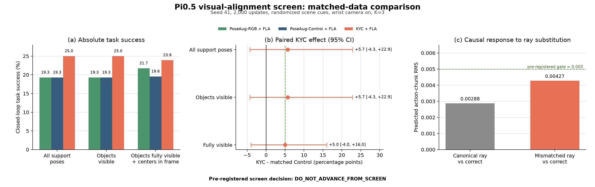
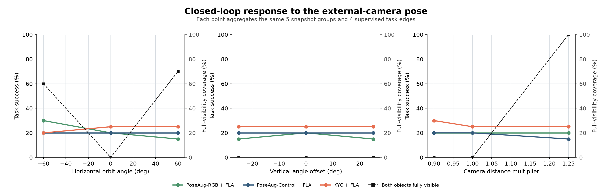

# KYC × Pi0.5 视觉对齐筛选结果

更新时间：2026-08-03

## 结论摘要

本轮补上了此前最重要的训练混杂因素：不再完全冻结 Pi0.5 的视觉编码器，而是在
SigLIP 视觉塔加入 rank-16 低秩适配（FLA），再公平比较无 ray、固定 ray 和真实
ray 三种方法。

预注册结论为：

> **DO_NOT_ADVANCE_FROM_SCREEN**：当前证据不足以进入同配置 33K updates、
> 三随机种子的完整确认实验。

这不是“证明 KYC 无效”，而是以下三条同时成立：

1. KYC 相对匹配 Control 出现了方向正确但不确定的行为增益；
2. 视觉适配确实让 Pi0.5 更能响应 ray，但还没有达到预注册因果门槛；
3. KYC 没有稳定优于只做相同多视角训练的 RGB 基线。

因此，不应继续在当前固定 LIBERO 单任务设置中追加训练预算。若要严谨判断
KYC 对 Pi0.5 的价值，下一步应转到带相机参数、非固定视觉环境的
LIBERO-Plus，并先修复 external-camera-only 基线。

## 实验到底比较了什么

三种方法使用完全相同的 Pi0.5 初始化、训练图像、动作、数据顺序、优化器、
2,000 updates 和 seed 41。训练时均随机改变第三人称相机位姿并随机化场景线索，
保留腕部相机。唯一核心差别是相机几何输入：

| 方法 | 第三人称 RGB | ray map | SigLIP 视觉适配 |
|---|---|---|---|
| PoseAug-RGB + FLA | 随机多视角 | 无 | 有 |
| PoseAug-Control + FLA | 同一批随机多视角 | 永远使用默认相机 ray | 有 |
| KYC + FLA | 同一批随机多视角 | 使用当前真实相机 ray | 有 |

这里的 **ray map** 是逐像素相机射线，编码“该像素从哪里出发、朝哪个三维方向
看”。Control 也拥有与 KYC 相同的分支容量，但故意给错成固定默认相机几何，
所以 `KYC - Control` 才是“真实位姿信息本身”的增量。

FLA 只适配 SigLIP 27 层 MLP 的 `fc1/fc2`，共 54 个低秩分支、4,713,984 个
参数。基础 SigLIP、语言模型和多模态 projector 均保持冻结；这避免了 3B VLM
全量微调的显存成本，也直接检验“冻结视觉空间导致 ray 无法对齐”的假设。

## 评测协议

- 任务：LIBERO BIND 四条已监督任务边；
- 初始状态：5 个相同 snapshot group；
- 相机位姿：7 个，均位于训练支持范围边界内；
- 执行频率：固定 `K=3`；
- 每种方法：`5 × 4 × 7 = 140` 个闭环 episode；
- 三种方法合计：420 个闭环 episode；
- 统计独立单位：snapshot group，`n=5`，不是把 140 帧/episode 当独立样本。

三个相机维度的中文含义：

| 名称 | 本轮取值 | 含义 |
|---|---:|---|
| 水平环绕角（Azimuth） | -60°、0°、+60° | 相机绕桌面目标向左/向右水平转动 |
| 垂直俯仰偏移（Elevation） | -25°、0°、+25° | 相机相对默认视角降低/抬高 |
| 距离倍率（Radius scale） | 0.90、1.00、1.25 | 相机到观察中心距离变为默认的 90%、100%、125% |

本轮只移动固定在场景中的第三人称相机；腕部相机安装在机械臂末端，仍会随手臂
运动，但不受这次第三人称相机位姿干预。

## 闭环结果

| 统计层级 | RGB + FLA | Control + FLA | KYC + FLA |
|---|---:|---:|---:|
| 训练支持范围内全部位姿，140 条/方法 | 19.29% | 19.29% | **25.00%** |
| 两个任务物体均可见，140 条/方法 | 19.29% | 19.29% | **25.00%** |
| 物体完整可见且中心在画面内，46 条/方法 | 21.74% | 19.57% | **23.91%** |

在全部支持位姿上，KYC 相对 Control：

- 完整任务成功率：`+5.71 pp`，95% CI `[-4.29,+22.86] pp`；
- 搬运子目标成功率：`+10.71 pp`，95% CI `[-0.71,+25.71] pp`；
- 任务进度：`+4.64 pp`，95% CI `[-7.86,+20.71] pp`。

在严格完整可见层级上，按 snapshot group 等权后的 KYC 成功率增量为
`+5.00 pp`，95% CI `[-4.00,+16.00] pp`。方向是正的，但区间跨 0，且只有
5 个独立初始状态，不能解释为稳定效果。

KYC 相对 RGB 在全部支持位姿上同样为 `+5.71 pp`，95% CI
`[-5.00,+19.29] pp`；在严格完整可见层级只剩 `+1.50 pp`。因此还不能证明
显式几何优于多视角 RGB 增强。

## 相机位姿影响

图中彩色实线是闭环任务成功率，黑色虚线是“两个任务物体完整可见且中心仍在
画面内”的比例。需要区分两个可见性概念：

- 7 个位姿下两个任务物体都至少部分可见，未出现整个目标完全离开画面；
- 严格完整可见率随位姿明显变化：默认、俯仰 ±25° 和近距离 0.90 倍为 0%，
  水平 -60° 为 60%，水平 +60° 为 70%，远距离 1.25 倍为 100%。

所以黑线表示物体边缘是否被裁切，而不是“目标是否彻底消失”。本轮是训练支持
范围内的中等位姿筛选，不能替代更大范围的 out-of-view 边界扫描。

行为曲线的主要观察是：

- Control 在各位姿约 15%–20%，非常平坦；
- KYC 在各位姿约 20%–30%，也较平坦；
- RGB 在水平 -60° 达到 30%，在 +60° 降到 15%，波动更大；
- 多视角训练已经带来较强位姿不变性，显式 ray 的潜在价值主要表现为小幅、
  尚不确定的整体抬升，而不是修复某一个明显崩溃的相机角度。

## 模型是否真的使用 ray

在完全相同的 RGB、state 和语言输入下，只替换 ray：

| 替换方式 | 动作块 RMS | 第一动作 RMS | 动作余弦相似度 |
|---|---:|---:|---:|
| 默认 ray 与正确 ray | 0.002878 | 0.001884 | 0.999841 |
| 错配 ray 与正确 ray | 0.004275 | 0.002246 | 0.999569 |

此前冻结视觉塔时，默认 ray 替换的动作块 RMS 约为 `0.000710`。FLA 后升至
`0.002878`，约为原来的 4.1 倍，说明“视觉特征未对齐”确实是此前模型忽略
ray 的一个原因。

但错配 ray 的 RMS `0.004275` 仍低于预注册门槛 `0.005`，而且动作余弦相似度
仍接近 1。结论只能是“ray 使用增强，但尚未形成足够强的因果控制信号”。

## 预注册门槛与裁决

| 门槛 | 结果 | 是否通过 |
|---|---:|---|
| RGB/Control 至少一个严格层级成功率 ≥20% | RGB 21.74% | 是 |
| KYC 相对 Control 严格层级提升 ≥5 pp | 约 +5.00 pp，CI 跨 0 | 边界值 |
| 错配 ray 动作块 RMS ≥0.005 | 0.004275 | 否 |

由于第三项明确未通过，即使把浮点表示下的 `4.999999... pp` 视为精确
`5.00 pp`，最终裁决也不改变：

> **DO_NOT_ADVANCE_FROM_SCREEN**

这排除了“直接在当前设置跑 33K × 3 seeds”的方案，但不排除在更合适的数据域
继续验证 KYC。

## 下一步建议

1. 不继续追加当前固定 LIBERO 单任务的训练步数；当前瓶颈已从“视觉完全冻结”
   转为“显式几何是否在非固定环境中提供独特信息”。
2. 使用 LIBERO-Plus 的 `assets.zip`（约 6.4 GB）与
   `libero_plus_camparam_rlds.zip`（约 16.6 GB）建立带真实相机外参、变化背景的
   正式评测。普通无相机参数版本和 75.5 GB 全量 RLDS 目前不需要。
3. 先将 external-camera-only 的 RGB/Control 基线训练到至少 20% 成功率，再做
   wrist-on/off 对照；不能沿用当前约 1% 的 wrist-off 失败基线裁决 KYC。
4. 在 LIBERO-Plus 上仍保持 RGB、固定-ray Control、真实-ray KYC 三者数据和容量
   匹配，并保留 wrong-ray 因果审计。只有真实 ray 稳定优于两种基线且错配 ray
   会伤害行为，才值得扩展到三种子正式确认。
5. 暂不做 3B VLM 全量微调。4.7M 参数视觉适配已经明显提高 ray 响应；先解决
   数据域和 baseline 有效性，比继续增加视觉训练参数更可解释。

## 产物

- 机器可读汇总：`docs/cabi_vla/kyc_pi05_visual_alignment_result.json`；
- 完整运行汇总：
  `/share/longjunyu/cabi-vla/kyc-visual-alignment-v1/eval/screen-s41-steps2000/summary.json`；
- 三个最终模型：
  `/share/longjunyu/cabi-vla/kyc-visual-alignment-v1/runs/screen-steps2000/`；
- 420 条闭环评测：
  `/share/longjunyu/cabi-vla/kyc-visual-alignment-v1/eval/screen-s41-steps2000/`。
