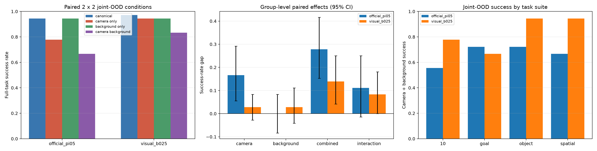

# Pi0.5 多视角训练能否抵抗相机与背景联合域外变化？

## 一句话结论

**没有完全解决。** 多视角训练把固定背景下的相机扰动缺口从 16.7 个百分点降到 2.8 点，但当未见桌面/背景外观与相机扰动同时出现时，当前最强模型仍从 97.2% 降到 83.3%，保留率仅 85.7%。结论为：

> **多视角数据非常有效，但只覆盖相机变化不足以抵抗相机与新背景的联合域外变化。**

## 实验回答什么

对每个任务和初始状态构造严格配对的四格评测：

| 条件 | 第三方相机 | 桌面/背景外观 |
|---|---|---|
| Canonical | 原始 | 原始 |
| Camera-only | 官方相机扰动 | 原始 |
| Background-only | 原始 | 未见纹理 |
| Camera+Background | 同一相机扰动 | 同一未见纹理 |

- 36 个基础任务，四个 LIBERO suite 各 9 个；每任务 2 个初态。
- 每模型 288 条、两个模型共 576 条闭环 episode。
- 四条件共享任务、语言、物体布局、机器人初态、策略噪声和控制参数。
- 576 条结果全部完成，物理初态 SHA-256 不一致为 0。
- 独立统计单位为基础任务；任务内先平均两个初态，再做 20,000 次 paired bootstrap。

当前 `visual_b025` 使用 25% LIBERO-Plus 多相机数据、视觉 LoRA、33k 步训练。训练数据清单记录相机位姿，但没有桌面/背景纹理增强；因此本实验验证的是“相机训练在额外场景外观变化下是否仍稳健”，不是已经在两个因素上分别训练后的严格组合留出。精确审计还确认：训练与评测的外部相机 4×4 位姿矩阵无重合，36 个任务身份全部重合，四条件物理初态完全配对。

## 主要结果

| 模型 | 原始 | 仅相机 | 仅背景 | 相机+背景 |
|---|---:|---:|---:|---:|
| 官方 Pi0.5 | 94.4% | 77.8% | 94.4% | 66.7% |
| 强多视角 `visual_b025` | **97.2%** | **94.4%** | **94.4%** | **83.3%** |

### 1. 多视角训练确实有效

- 相机单因素成功率提高 **16.7 点**，95% CI `[5.6, 29.2]`。
- 相机+背景组合成功率提高 **16.7 点**，95% CI `[6.9, 27.8]`。
- 相对官方模型，组合总缺口缩小 **13.9 点**，95% CI `[4.2, 25.0]`。

所以不能把结论说成“多视角训练没用”。它是当前提升视角鲁棒性的主要来源。

### 2. 单因素接近解决，组合仍未解决

强多视角模型：

- 原背景上的相机缺口：**2.8 点**，CI `[-2.8, 8.3]`。
- 原相机下的背景缺口：**2.8 点**，CI `[-4.2, 11.1]`。
- 相机和背景同时变化的总缺口：**13.9 点**，CI `[4.2, 25.0]`。
- 新背景上的相机缺口：**11.1 点**，CI `[2.8, 20.8]`。

两种单因素分别出现时都接近无损，但叠加后显著下降。这不是简单的“目标离开视野”：协议烟测验证相机和背景因素独立，腕部相机在只改变第三方相机时逐像素一致。

### 3. 存在直接的联合条件特有失败案例

`visual_b025` 有 **7/72** 个初态满足：原始、仅相机、仅背景三种条件均成功，唯独相机+背景组合失败。按任务聚合率为 9.7%，95% CI `[2.8, 18.1]`。

这比单纯比较平均成功率更直接地表明，模型会在两个单独评测可处理的变化同时出现时失效；由于训练集没有背景因素，这仍是联合域外失败证据，不是严格留组合证据。

## 缺口在哪里

| Suite | 强模型原始 | 强模型组合 | 组合缺口 |
|---|---:|---:|---:|
| LIBERO-Goal | 94.4% | **66.7%** | **27.8 点** |
| LIBERO-10 | 94.4% | **77.8%** | **16.7 点** |
| LIBERO-Object | 100.0% | 94.4% | 5.6 点 |
| LIBERO-Spatial | 100.0% | 94.4% | 5.6 点 |

进一步分层显示：

- 相机难度 5：组合成功率 62.5%，总缺口 37.5 点。
- 水平环绕视角（orbit yaw）：组合成功率 62.5%，总缺口 31.2 点。
- 复杂长程任务和目标约束任务是主要失败来源；简单物体与空间任务基本解决。

## 对研究方向的含义

1. **视角问题仍值得做，但问题定义应升级。** 固定背景下的静态相机泛化已接近被多视角数据解决；真正剩余的是相机变化与场景外观、几何、任务复杂度之间的组合泛化。
2. **不能据此直接支持 KYC。** 结果证明需要比“只增加相机数据”更强的机制，但没有证明显式 ray map 或相机位姿输入能解决外观—几何交互；此前 raw-ray KYC 在 Pi0.5 上也没有稳定优势。
3. **更合理的模型目标是因子化和组合一致性。** 需要让策略把任务相关几何、相机投影和场景外观分开表示，并在组合变化下保持动作语义，而不只是记忆更多视角。
4. **RoboCasa 验证仍必要。** 当前“新场景”只改变桌面和背景纹理，没有覆盖新厨房几何、物体布局、真实相机动态或真机域迁移。4 卡机的 RoboCasa 相机×场景实验将决定这个缺口能否扩展到更真实的场景组合。

## 当前裁决

**`RESIDUAL_JOINT_CAMERA_BACKGROUND_OOD_GAP_CONFIRMED`**

- 多视角训练：继续作为强基线，不否定。
- “多视角数据已经彻底解决视角泛化”：否。
- 立即继续堆更多随机相机数据：证据不足。
- 下一方法阶段：围绕相机—场景因子化与组合一致性设计最小算法，同时用 RoboCasa 检查几何/布局组合是否复现该缺口。

修正术语后的机器结果和图位于 `final-joint-ood-v2`；完整 AV1/WebM 视频和可复现实验协议位于同一实验根目录：

`/share/longjunyu/alphabrain/experiments/libero-plus-camera-background-v1/`
